# Feature Store System Design Interview
## Staff Machine Learning Infrastructure Engineer - FAANG Company

**Position:** Staff Machine Learning Infrastructure Engineer  
**Company:** Top-Tier Tech Company (FAANG)  
**Date:** February 2026  
**Duration:** 60 minutes

---

## Table of Contents
1. [Problem Statement & Requirements](#problem-statement--requirements)
2. [High-Level Architecture](#high-level-architecture)
3. [Component Deep Dive](#component-deep-dive)
4. [Online Serving Architecture](#online-serving-architecture)
5. [Data Quality & Monitoring](#data-quality--monitoring)
6. [Feature Versioning & Reproducibility](#feature-versioning--reproducibility)
7. [Cost Optimization](#cost-optimization)
8. [Failure Handling & Recovery](#failure-handling--recovery)
9. [Migration Strategy](#migration-strategy)
10. [Success Metrics](#success-metrics)

---

## Problem Statement & Requirements

### Initial Question
**Interviewer:** Design a feature store on GCP that can serve both batch and real-time ML use cases at scale.

### Clarifying Questions & Answers

**Candidate's Questions:**

**Scale and Performance:**
- Expected scale? Thousands or millions of features?
- Read QPS for online serving?
- Acceptable latency for online feature retrieval?
- Batch dataset size and freshness requirements?

**Feature Characteristics:**
- Types of features (numeric, categorical, embeddings, time-series)?
- Need for point-in-time correctness?
- Feature freshness requirements?

**Users and Use Cases:**
- Number of ML teams/models using this?
- Feature discovery and lineage tracking required?
- Support for feature transformations?

**Interviewer's Requirements:**
- **100K+ features** across 50+ ML teams
- **Online latency: <20ms** at 100K QPS peak
- **Batch processing:** 10TB/day datasets
- **Mixed feature types** including embeddings
- **Point-in-time correctness:** Critical requirement
- **Feature freshness:** 5-15 minutes
- **Feature discovery & lineage:** Must-have

---

## High-Level Architecture

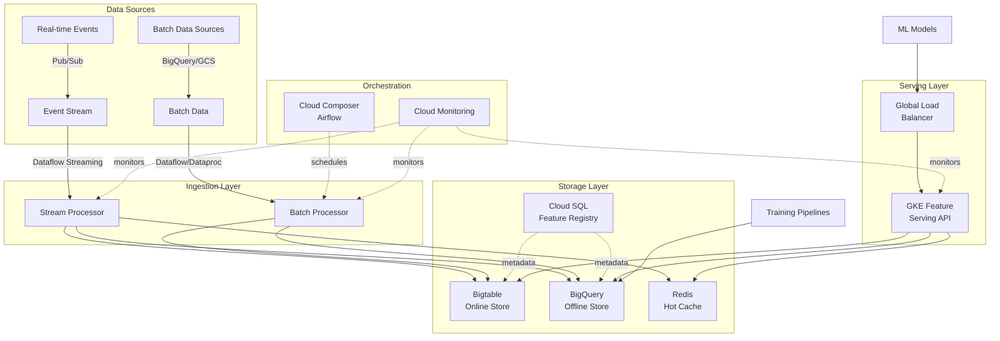

### Three-Tier Architecture

**1. Storage Layer**
- **Offline Store:** BigQuery - historical features, training datasets
- **Online Store:** Bigtable - low-latency feature serving
- **Streaming Buffer:** Redis (Memorystore) - ultra-fresh features
- **Metadata Store:** Cloud SQL - feature registry, lineage

**2. Compute Layer**
- Dataflow for streaming ingestion from Pub/Sub
- Dataflow/Dataproc for batch feature computation
- Cloud Functions for lightweight transformations

**3. Metadata Layer**
- Cloud SQL (PostgreSQL) for feature registry
- Dataplex for data governance and discovery

---

## Component Deep Dive

### Feature Registry (Metadata Store)

**Database Schema:**

```sql
-- Feature Groups
CREATE TABLE feature_groups (
    id SERIAL PRIMARY KEY,
    name VARCHAR(255) NOT NULL,
    entity_type VARCHAR(100) NOT NULL,
    owner VARCHAR(255) NOT NULL,
    description TEXT,
    created_at TIMESTAMP DEFAULT NOW(),
    updated_at TIMESTAMP DEFAULT NOW(),
    UNIQUE(name, entity_type)
);

-- Features
CREATE TABLE features (
    id SERIAL PRIMARY KEY,
    group_id INTEGER REFERENCES feature_groups(id),
    name VARCHAR(255) NOT NULL,
    dtype VARCHAR(50) NOT NULL,
    freshness_sla_minutes INTEGER,
    version VARCHAR(20) NOT NULL,
    is_deprecated BOOLEAN DEFAULT FALSE,
    default_value TEXT,
    created_at TIMESTAMP DEFAULT NOW(),
    UNIQUE(group_id, name, version)
);

-- Feature Lineage
CREATE TABLE feature_lineage (
    id SERIAL PRIMARY KEY,
    feature_id INTEGER REFERENCES features(id),
    source_table VARCHAR(255),
    transformation_logic TEXT,
    dependencies JSONB,
    created_at TIMESTAMP DEFAULT NOW()
);

-- Materialization Jobs
CREATE TABLE materialization_jobs (
    id SERIAL PRIMARY KEY,
    feature_group_id INTEGER REFERENCES feature_groups(id),
    schedule_cron VARCHAR(100),
    last_run_time TIMESTAMP,
    last_run_status VARCHAR(50),
    next_run_time TIMESTAMP
);
```

**Python API Example:**

```python
from feature_store import FeatureRegistry

registry = FeatureRegistry()

# Search for features
features = registry.search_features(
    entity_type="user",
    owner="recommendations_team",
    tags=["engagement"],
    freshness_sla_minutes=15
)

# Get feature lineage
lineage = registry.get_lineage(feature_id=12345)
print(f"Source: {lineage.source_table}")
print(f"Dependencies: {lineage.dependencies}")
```

### Ingestion Pipeline Architecture

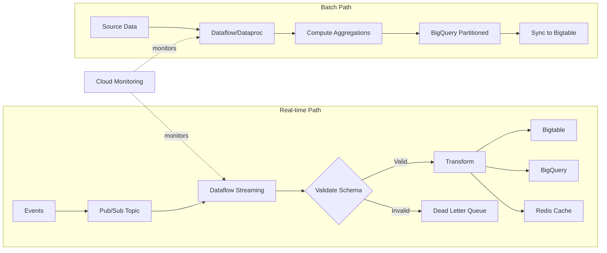

**Real-time Streaming Pipeline:**

```python
import apache_beam as beam
from apache_beam.options.pipeline_options import PipelineOptions

class FeatureTransform(beam.DoFn):
    def process(self, element):
        # Validate against schema
        if not validate_schema(element):
            yield beam.pvalue.TaggedOutput('invalid', element)
            return
        
        # Apply transformations
        features = {
            'entity_id': element['user_id'],
            'feature_timestamp': element['event_time'],
            'engagement_score': calculate_engagement(element),
            'session_count_7d': rolling_count(element, days=7)
        }
        
        yield features

def run_streaming_pipeline():
    options = PipelineOptions(
        streaming=True,
        project='my-project',
        region='us-central1'
    )
    
    with beam.Pipeline(options=options) as p:
        # Read from Pub/Sub
        events = (p 
            | 'Read Events' >> beam.io.ReadFromPubSub(
                topic='projects/my-project/topics/user-events'
            )
            | 'Parse JSON' >> beam.Map(json.loads)
        )
        
        # Transform and split
        transformed = events | 'Transform' >> beam.ParDo(
            FeatureTransform()
        ).with_outputs('invalid', main='valid')
        
        # Write valid features to multiple sinks
        (transformed.valid 
            | 'Write to Bigtable' >> beam.io.WriteToBigTable(
                project='my-project',
                instance='feature-store',
                table='online_features'
            )
        )
        
        (transformed.valid
            | 'Write to BigQuery' >> beam.io.WriteToBigQuery(
                'my-project:features.streaming_features',
                schema=FEATURE_SCHEMA,
                write_disposition=beam.io.BigQueryDisposition.WRITE_APPEND
            )
        )
        
        # Handle invalid records
        (transformed.invalid
            | 'Write to DLQ' >> beam.io.WriteToPubSub(
                topic='projects/my-project/topics/dead-letter-queue'
            )
        )
```

### Point-in-Time Correctness

**Critical for Training Data:**

```sql
-- Point-in-time join in BigQuery
WITH labels AS (
  SELECT 
    user_id,
    label,
    event_timestamp
  FROM `project.dataset.labels`
  WHERE date BETWEEN '2026-01-01' AND '2026-02-01'
),
features_pit AS (
  SELECT 
    l.user_id,
    l.label,
    l.event_timestamp,
    f.* EXCEPT(user_id, feature_timestamp)
  FROM labels l
  LEFT JOIN `project.dataset.user_features` f
  ON l.user_id = f.user_id
  AND f.feature_timestamp <= l.event_timestamp
  -- Get the most recent feature value before the label timestamp
  AND f.feature_timestamp = (
    SELECT MAX(feature_timestamp)
    FROM `project.dataset.user_features` f2
    WHERE f2.user_id = l.user_id
    AND f2.feature_timestamp <= l.event_timestamp
  )
)
SELECT * FROM features_pit;
```

**Why This Matters:**

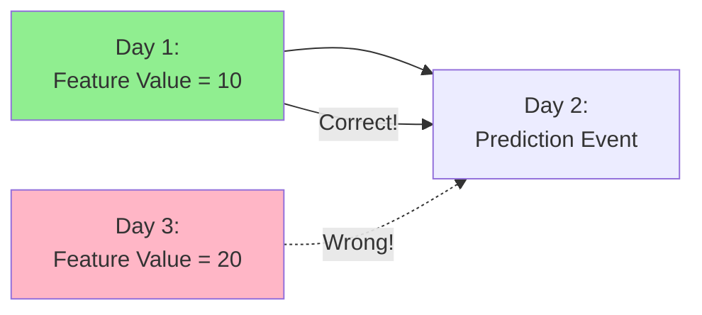

Without point-in-time correctness, you'd use future feature values (Day 3) to predict Day 2 events, causing **data leakage** and inflated offline metrics that don't translate to production.

---

## Online Serving Architecture

### Bigtable Schema Design

**Row Key Design:**
```
{entity_type}#{entity_id}#{timestamp_reverse}
```

**Example:**
```
user#12345#9999999999-1708099200
```

**Why reverse timestamp?** 
- Bigtable scans are sequential
- Reverse timestamp puts latest values first
- Efficient for "get latest features" queries

**Column Families:**

```
user_features:
  - engagement_score (value: 0.85, timestamp: 1708099200)
  - lifetime_value (value: 250.50, timestamp: 1708099200)
  - last_purchase_days (value: 7, timestamp: 1708099200)

item_features:
  - category (value: "electronics", timestamp: 1708099200)
  - price_tier (value: "premium", timestamp: 1708099200)

derived_features:
  - user_item_affinity (value: 0.92, timestamp: 1708099200)
```

### Feature Serving API

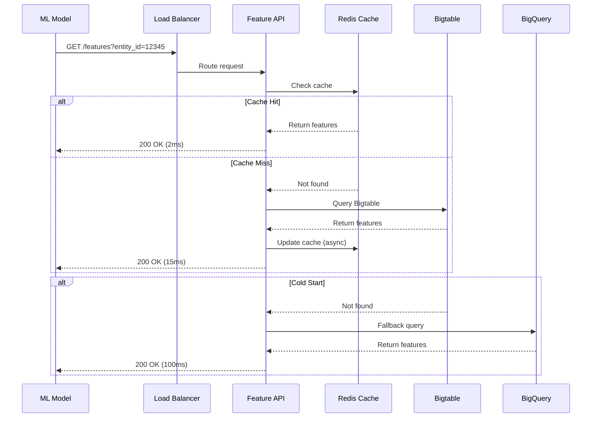

**Implementation:**

```python
from fastapi import FastAPI, HTTPException
from google.cloud import bigtable
import redis.asyncio as redis
import asyncio
from typing import List, Dict

app = FastAPI()

class FeatureServer:
    def __init__(self):
        self.redis_client = redis.Redis(
            host='memorystore-ip',
            port=6379,
            decode_responses=True
        )
        self.bt_client = bigtable.Client(project='my-project')
        self.bt_instance = self.bt_client.instance('feature-store')
        self.bt_table = self.bt_instance.table('online_features')
    
    async def get_features(
        self, 
        entity_type: str,
        entity_id: str, 
        feature_list: List[str]
    ) -> Dict[str, any]:
        """
        Three-tier lookup: Redis -> Bigtable -> BigQuery
        """
        # L1: Check Redis cache
        cache_key = f"{entity_type}:{entity_id}"
        cached = await self.redis_client.get(cache_key)
        
        if cached:
            features = json.loads(cached)
            return self._filter_features(features, feature_list)
        
        # L2: Query Bigtable
        row_key = f"{entity_type}#{entity_id}#".encode()
        row = self.bt_table.read_row(row_key)
        
        if row:
            features = self._parse_bigtable_row(row)
            
            # Async cache update (don't block response)
            asyncio.create_task(
                self.redis_client.setex(
                    cache_key,
                    300,  # 5 min TTL
                    json.dumps(features)
                )
            )
            
            return self._filter_features(features, feature_list)
        
        # L3: Fallback to BigQuery (cold start)
        # Log this - shouldn't happen often
        logger.warning(f"Cold start for {entity_type}:{entity_id}")
        features = await self._query_bigquery(entity_type, entity_id)
        
        return self._filter_features(features, feature_list)
    
    def _parse_bigtable_row(self, row) -> Dict:
        """Parse Bigtable row into feature dict"""
        features = {}
        for column_family_id, column_family in row.cells.items():
            for column_id, cells in column_family.items():
                # Get latest value (cells are sorted by timestamp desc)
                latest_cell = cells[0]
                feature_name = column_id.decode()
                feature_value = latest_cell.value.decode()
                features[feature_name] = json.loads(feature_value)
        return features
    
    def _filter_features(
        self, 
        all_features: Dict, 
        requested: List[str]
    ) -> Dict:
        """Return only requested features"""
        return {k: v for k, v in all_features.items() if k in requested}

@app.get("/features/{entity_type}/{entity_id}")
async def get_features(
    entity_type: str,
    entity_id: str,
    features: str  # comma-separated list
):
    """
    GET /features/user/12345?features=engagement_score,lifetime_value
    """
    feature_list = features.split(',')
    
    server = FeatureServer()
    result = await server.get_features(entity_type, entity_id, feature_list)
    
    return {
        "entity_type": entity_type,
        "entity_id": entity_id,
        "features": result,
        "timestamp": datetime.utcnow().isoformat()
    }
```

### Scaling Strategy

**Infrastructure:**
- **Bigtable:** 100+ nodes with regional replication
- **Redis:** Cluster mode with 50GB+ memory per shard
- **GKE:** 50-200 pods with Horizontal Pod Autoscaler
- **Load Balancing:** Global HTTP(S) LB with Cloud CDN

**Kubernetes Deployment:**

```yaml
apiVersion: apps/v1
kind: Deployment
metadata:
  name: feature-server
spec:
  replicas: 50
  selector:
    matchLabels:
      app: feature-server
  template:
    metadata:
      labels:
        app: feature-server
    spec:
      containers:
      - name: feature-server
        image: gcr.io/my-project/feature-server:v1.0
        resources:
          requests:
            memory: "2Gi"
            cpu: "1000m"
          limits:
            memory: "4Gi"
            cpu: "2000m"
        env:
        - name: BIGTABLE_INSTANCE
          value: "feature-store"
        - name: REDIS_HOST
          value: "memorystore-ip"
---
apiVersion: autoscaling/v2
kind: HorizontalPodAutoscaler
metadata:
  name: feature-server-hpa
spec:
  scaleTargetRef:
    apiVersion: apps/v1
    kind: Deployment
    name: feature-server
  minReplicas: 50
  maxReplicas: 200
  metrics:
  - type: Resource
    resource:
      name: cpu
      target:
        type: Utilization
        averageUtilization: 70
  - type: Pods
    pods:
      metric:
        name: http_request_latency_p99
      target:
        type: AverageValue
        averageValue: "18m"  # 18ms p99 latency
```

---

## Data Quality & Monitoring

### Schema Validation

```python
import apache_beam as beam
from apache_beam.io.gcp.bigquery_tools import parse_table_schema_from_json

class ValidateSchema(beam.DoFn):
    def __init__(self, schema_registry):
        self.schema_registry = schema_registry
    
    def process(self, element):
        feature_group = element['feature_group']
        schema = self.schema_registry.get_schema(feature_group)
        
        # Validate data types
        for field in schema.fields:
            if field.name not in element:
                if field.mode == 'REQUIRED':
                    yield beam.pvalue.TaggedOutput('invalid', {
                        'element': element,
                        'error': f'Missing required field: {field.name}'
                    })
                    return
            else:
                value = element[field.name]
                if not self._validate_type(value, field.field_type):
                    yield beam.pvalue.TaggedOutput('invalid', {
                        'element': element,
                        'error': f'Type mismatch for {field.name}'
                    })
                    return
        
        yield element
    
    def _validate_type(self, value, expected_type):
        type_map = {
            'STRING': str,
            'INTEGER': int,
            'FLOAT': float,
            'BOOLEAN': bool
        }
        return isinstance(value, type_map.get(expected_type, str))
```

### Data Quality Checks

```python
import great_expectations as ge
from google.cloud import bigquery

class DataQualityMonitor:
    def __init__(self, project_id):
        self.bq_client = bigquery.Client(project=project_id)
        self.context = ge.get_context()
    
    def run_quality_checks(self, table_id, feature_group):
        """Run quality checks on newly ingested features"""
        
        # Load data
        query = f"""
        SELECT * FROM `{table_id}`
        WHERE date = CURRENT_DATE()
        AND feature_group = '{feature_group}'
        """
        df = self.bq_client.query(query).to_dataframe()
        
        # Create GE dataset
        ge_df = ge.from_pandas(df)
        
        # Define expectations
        expectations = {
            'null_rate': lambda col: ge_df.expect_column_values_to_not_be_null(
                col, mostly=0.95  # Allow 5% nulls
            ),
            'value_range': lambda col, min_val, max_val: 
                ge_df.expect_column_values_to_be_between(
                    col, min_value=min_val, max_value=max_val
                ),
            'unique_values': lambda col: ge_df.expect_column_values_to_be_unique(col),
            'freshness': lambda: self._check_freshness(df, hours=1)
        }
        
        # Run checks
        results = []
        for check_name, check_fn in expectations.items():
            result = check_fn()
            results.append({
                'check': check_name,
                'success': result.success,
                'observed_value': result.result
            })
        
        # Alert on failures
        failures = [r for r in results if not r['success']]
        if failures:
            self._send_alert(feature_group, failures)
        
        return results
    
    def _check_freshness(self, df, hours=1):
        """Check if features are fresh"""
        max_timestamp = df['feature_timestamp'].max()
        age_hours = (datetime.utcnow() - max_timestamp).total_seconds() / 3600
        return age_hours < hours
    
    def _send_alert(self, feature_group, failures):
        """Send alert to monitoring system"""
        message = f"Data quality failures for {feature_group}: {failures}"
        # Send to PagerDuty, Slack, etc.
        logger.error(message)
```

### Monitoring Dashboard

**Key Metrics to Track:**

```mermaid
graph TB
    subgraph "Ingestion Metrics"
        A[Events/sec] --> B[Processing Lag]
        B --> C[Error Rate]
        C --> D[Data Quality Score]
    end
    
    subgraph "Serving Metrics"
        E[QPS] --> F[P50/P95/P99 Latency]
        F --> G[Cache Hit Rate]
        G --> H[Error Rate]
    end
    
    subgraph "Feature Health"
        I[Freshness Lag] --> J[Null Rate]
        J --> K[Schema Violations]
        K --> L[Distribution Drift]
    end
    
    subgraph "Cost Metrics"
        M[Storage Cost/GB] --> N[Compute Cost/hour]
        N --> O[Cost per Feature]
    end
```

**Cloud Monitoring Configuration:**

```python
from google.cloud import monitoring_v3
import time

def create_monitoring_alerts(project_id):
    client = monitoring_v3.AlertPolicyServiceClient()
    project_name = f"projects/{project_id}"
    
    # Feature freshness alert
    freshness_alert = monitoring_v3.AlertPolicy(
        display_name="Feature Freshness SLA Breach",
        conditions=[
            monitoring_v3.AlertPolicy.Condition(
                display_name="Freshness lag > 30 minutes",
                condition_threshold=monitoring_v3.AlertPolicy.Condition.MetricThreshold(
                    filter='metric.type="custom.googleapis.com/feature/freshness_lag_seconds"',
                    comparison=monitoring_v3.ComparisonType.COMPARISON_GT,
                    threshold_value=1800,  # 30 minutes
                    duration={"seconds": 300},  # For 5 minutes
                ),
            )
        ],
        notification_channels=[
            "projects/{project}/notificationChannels/{channel_id}"
        ],
        alert_strategy=monitoring_v3.AlertPolicy.AlertStrategy(
            auto_close={"seconds": 3600}  # Auto-close after 1 hour
        ),
    )
    
    # Serving latency alert
    latency_alert = monitoring_v3.AlertPolicy(
        display_name="Feature Serving P99 Latency SLA Breach",
        conditions=[
            monitoring_v3.AlertPolicy.Condition(
                display_name="P99 latency > 20ms",
                condition_threshold=monitoring_v3.AlertPolicy.Condition.MetricThreshold(
                    filter='metric.type="custom.googleapis.com/feature/serving_latency_p99"',
                    comparison=monitoring_v3.ComparisonType.COMPARISON_GT,
                    threshold_value=20,  # 20ms
                    duration={"seconds": 180},  # For 3 minutes
                ),
            )
        ],
    )
    
    # Create alerts
    client.create_alert_policy(name=project_name, alert_policy=freshness_alert)
    client.create_alert_policy(name=project_name, alert_policy=latency_alert)
```

---

## Feature Versioning & Reproducibility

### Semantic Versioning for Features

```python
from dataclasses import dataclass
from typing import Callable
import pandas as pd

@dataclass
class FeatureVersion:
    major: int  # Breaking changes
    minor: int  # Backward-compatible additions
    patch: int  # Bug fixes
    
    def __str__(self):
        return f"{self.major}.{self.minor}.{self.patch}"

class FeatureGroup:
    def __init__(self, name: str, entity_key: str, version: str):
        self.name = name
        self.entity_key = entity_key
        self.version = FeatureVersion(*map(int, version.split('.')))
        self.features = {}
    
    def feature(self, version: str):
        """Decorator to register feature with version"""
        def decorator(func: Callable):
            feature_version = FeatureVersion(*map(int, version.split('.')))
            self.features[func.__name__] = {
                'function': func,
                'version': feature_version
            }
            return func
        return decorator

# Example usage
@FeatureGroup(name="user_engagement", entity_key="user_id", version="2.1.0")
class UserEngagementFeatures:
    
    @feature(version="2.0.0")
    def sessions_7d(self, df: pd.DataFrame) -> pd.Series:
        """Count of sessions in last 7 days"""
        return df.groupby('user_id')['session_id'].nunique()
    
    @feature(version="2.1.0")  # New feature, minor version bump
    def avg_session_duration_7d(self, df: pd.DataFrame) -> pd.Series:
        """Average session duration in last 7 days"""
        return df.groupby('user_id')['session_duration'].mean()
    
    @feature(version="2.0.1")  # Bug fix, patch version
    def total_page_views_7d(self, df: pd.DataFrame) -> pd.Series:
        """Fixed: now correctly filters last 7 days"""
        cutoff = pd.Timestamp.now() - pd.Timedelta(days=7)
        recent_df = df[df['timestamp'] >= cutoff]
        return recent_df.groupby('user_id')['page_view'].sum()
```

### Training Dataset Snapshots

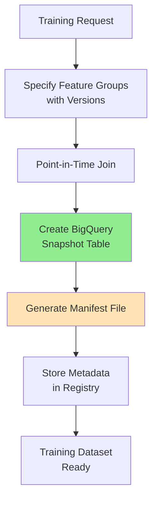

**Creating Reproducible Training Data:**

```python
from feature_store import FeatureStore
import pandas as pd

class TrainingDatasetBuilder:
    def __init__(self, feature_store: FeatureStore):
        self.fs = feature_store
    
    def create_training_dataset(
        self,
        dataset_name: str,
        labels_df: pd.DataFrame,
        feature_groups: List[Dict[str, str]],
        timestamp_column: str = 'event_timestamp'
    ):
        """
        Create immutable training dataset with exact feature versions
        
        Args:
            dataset_name: Unique name for this training dataset
            labels_df: DataFrame with entity_id, label, timestamp
            feature_groups: List of {'name': 'user_engagement', 'version': '2.1.0'}
            timestamp_column: Column name for point-in-time join
        """
        
        # 1. Validate feature versions exist
        for fg in feature_groups:
            if not self.fs.registry.version_exists(fg['name'], fg['version']):
                raise ValueError(f"Version {fg['version']} not found for {fg['name']}")
        
        # 2. Perform point-in-time join
        training_df = self.fs.get_historical_features(
            entity_df=labels_df,
            feature_groups=feature_groups,
            timestamp_column=timestamp_column
        )
        
        # 3. Create immutable snapshot in BigQuery
        snapshot_table = f"features.training_snapshots.{dataset_name}_{date.today()}"
        training_df.to_gbq(
            snapshot_table,
            project_id='my-project',
            if_exists='fail'  # Prevent overwrites
        )
        
        # 4. Generate manifest file
        manifest = {
            'dataset_name': dataset_name,
            'created_at': datetime.utcnow().isoformat(),
            'snapshot_table': snapshot_table,
            'feature_groups': feature_groups,
            'label_column': labels_df.columns.tolist(),
            'num_rows': len(training_df),
            'code_version': os.getenv('GIT_COMMIT_SHA'),
            'created_by': os.getenv('USER')
        }
        
        # 5. Store metadata in registry
        self.fs.registry.save_training_dataset_metadata(manifest)
        
        print(f"Training dataset created: {snapshot_table}")
        print(f"Manifest: {manifest}")
        
        return training_df, manifest

# Usage
fs = FeatureStore(project='my-project')
builder = TrainingDatasetBuilder(fs)

labels = pd.DataFrame({
    'user_id': [1, 2, 3],
    'label': [1, 0, 1],
    'event_timestamp': pd.to_datetime(['2026-02-01', '2026-02-02', '2026-02-03'])
})

training_df, manifest = builder.create_training_dataset(
    dataset_name='fraud_model_v1',
    labels_df=labels,
    feature_groups=[
        {'name': 'user_engagement', 'version': '2.1.0'},
        {'name': 'user_profile', 'version': '1.0.0'},
        {'name': 'transaction_features', 'version': '3.2.1'}
    ],
    timestamp_column='event_timestamp'
)
```

### Online-Offline Consistency

**Shared Transformation Library:**

```python
# shared_transforms.py
"""
Transformations used by both batch and streaming pipelines
This ensures training/serving consistency
"""

def calculate_engagement_score(user_events: pd.DataFrame) -> float:
    """
    Calculate engagement score from user events
    Used in both:
    - Batch: Dataflow job for historical features
    - Streaming: Real-time feature computation
    """
    weights = {
        'page_view': 1.0,
        'add_to_cart': 2.0,
        'purchase': 5.0,
        'review': 3.0
    }
    
    score = sum(
        user_events[user_events['event_type'] == event_type]['count'].sum() * weight
        for event_type, weight in weights.items()
    )
    
    return min(score / 100.0, 1.0)  # Normalize to [0, 1]

def rolling_window_count(
    df: pd.DataFrame,
    window_days: int,
    event_column: str
) -> pd.Series:
    """Count events in rolling window"""
    cutoff = pd.Timestamp.now() - pd.Timedelta(days=window_days)
    return df[df['timestamp'] >= cutoff].groupby('entity_id')[event_column].count()
```

**Testing Consistency:**

```python
import pytest
from shared_transforms import calculate_engagement_score

def test_batch_streaming_consistency():
    """Test that batch and streaming produce same results"""
    
    # Sample data
    user_events = pd.DataFrame({
        'user_id': [1, 1, 1],
        'event_type': ['page_view', 'add_to_cart', 'purchase'],
        'count': [10, 5, 2]
    })
    
    # Batch computation
    batch_score = calculate_engagement_score(user_events)
    
    # Streaming computation (simulate event-by-event)
    streaming_score = 0.0
    for _, event in user_events.iterrows():
        event_df = pd.DataFrame([event])
        streaming_score += calculate_engagement_score(event_df)
    
    # Should be equal (within floating point precision)
    assert abs(batch_score - streaming_score) < 1e-6, \
        f"Batch ({batch_score}) != Streaming ({streaming_score})"
```

---

## Cost Optimization

### Storage Tiering Strategy

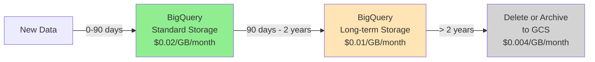

**BigQuery Partition & Clustering:**

```sql
-- Create partitioned and clustered table for cost-efficient queries
CREATE TABLE `project.features.user_engagement`
PARTITION BY DATE(feature_timestamp)
CLUSTER BY user_id, feature_group
OPTIONS(
    partition_expiration_days=730,  -- Auto-delete after 2 years
    require_partition_filter=true   -- Force partition pruning
) AS
SELECT * FROM source_table;

-- Efficient query (scans only necessary partitions)
SELECT 
    user_id,
    AVG(engagement_score) as avg_engagement
FROM `project.features.user_engagement`
WHERE DATE(feature_timestamp) BETWEEN '2026-01-01' AND '2026-02-16'  -- Partition filter
AND user_id IN UNNEST(@user_ids)  -- Cluster filter
GROUP BY user_id;

-- Query cost: ~$0.10 for 100GB table (only scans 5GB with partition filter)
-- Without partitioning: ~$0.50 (scans entire 100GB table)
```

**Bigtable Storage Optimization:**

```python
from google.cloud import bigtable
from google.cloud.bigtable import column_family

def configure_bigtable_storage():
    """Configure Bigtable with TTL and storage classes"""
    
    client = bigtable.Client(project='my-project')
    instance = client.instance('feature-store')
    table = instance.table('online_features')
    
    # Hot features: SSD, 7 day TTL
    hot_cf = column_family.MaxVersionsGCRule(1)
    hot_cf = column_family.GCRuleIntersection([
        hot_cf,
        column_family.MaxAgeGCRule(timedelta(days=7))
    ])
    table.column_family('hot_features', gc_rule=hot_cf)
    
    # Warm features: HDD, 30 day TTL
    warm_cf = column_family.MaxVersionsGCRule(1)
    warm_cf = column_family.GCRuleIntersection([
        warm_cf,
        column_family.MaxAgeGCRule(timedelta(days=30))
    ])
    table.column_family('warm_features', gc_rule=warm_cf)
    
    table.create()
    
    # Enable autoscaling
    cluster = instance.cluster('feature-store-cluster')
    cluster.update()
```

### Compute Optimization

**Dataflow Cost Reduction:**

```python
from apache_beam.options.pipeline_options import PipelineOptions

# Batch job options (40% cheaper with Flexible Resource Scheduling)
batch_options = PipelineOptions(
    runner='DataflowRunner',
    project='my-project',
    region='us-central1',
    temp_location='gs://my-bucket/temp',
    
    # Cost optimization
    flexrs_goal='COST_OPTIMIZED',  # Use Flexible Resource Scheduling
    machine_type='n2-standard-4',  # Right-sized machine
    disk_size_gb=50,
    max_num_workers=100,
    autoscaling_algorithm='THROUGHPUT_BASED',
    
    # Use preemptible VMs for batch (80% cheaper)
    use_public_ips=False,
    subnetwork='regions/us-central1/subnetworks/dataflow-subnet'
)

# Streaming job options
streaming_options = PipelineOptions(
    runner='DataflowRunner',
    streaming=True,
    enable_streaming_engine=True,  # Separates compute/storage
    
    # Start small, autoscale as needed
    num_workers=10,
    max_num_workers=50,
    autoscaling_algorithm='THROUGHPUT_BASED',
    
    # Resource efficiency
    worker_machine_type='n2-standard-2',
    disk_size_gb=30
)
```

### Caching Strategy (80% Cost Reduction)

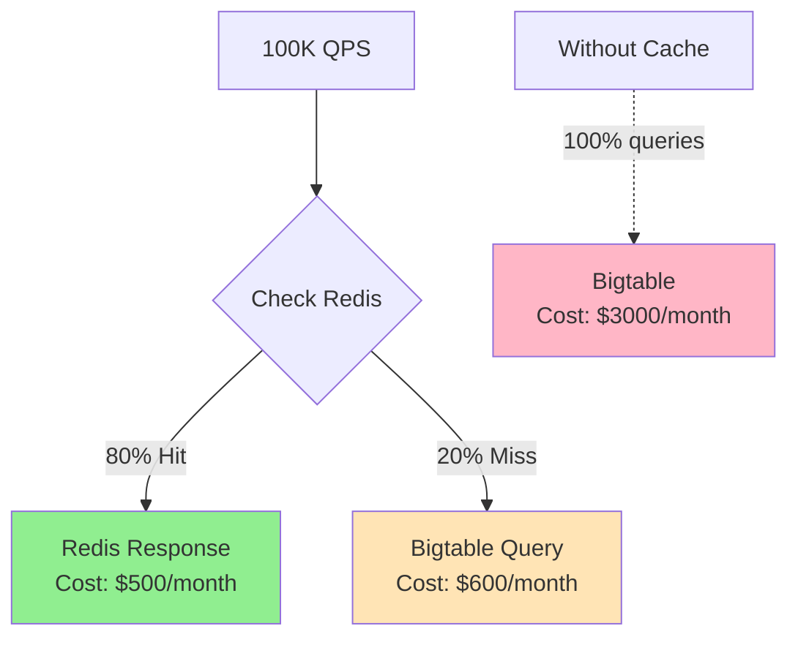

**Intelligent Cache Warming:**

```python
import asyncio
from typing import Set

class SmartCacheWarmer:
    """Proactively warm cache for high-traffic entities"""
    
    def __init__(self, redis_client, bigtable_client, bq_client):
        self.redis = redis_client
        self.bigtable = bigtable_client
        self.bq = bq_client
    
    async def warm_top_entities(self, top_n: int = 10000):
        """Warm cache for top N most-accessed entities"""
        
        # Query BigQuery for top entities by access frequency
        query = f"""
        SELECT entity_id, COUNT(*) as access_count
        FROM `project.logs.feature_access`
        WHERE timestamp > TIMESTAMP_SUB(CURRENT_TIMESTAMP(), INTERVAL 24 HOUR)
        GROUP BY entity_id
        ORDER BY access_count DESC
        LIMIT {top_n}
        """
        
        top_entities = self.bq.query(query).to_dataframe()
        
        # Batch load features for top entities
        tasks = [
            self._load_and_cache(entity_id)
            for entity_id in top_entities['entity_id']
        ]
        
        await asyncio.gather(*tasks)
        
        print(f"Cache warmed with {len(top_entities)} entities")
    
    async def _load_and_cache(self, entity_id: str):
        """Load from Bigtable and populate Redis"""
        features = await self.bigtable.read_row(entity_id)
        await self.redis.setex(
            f"user:{entity_id}",
            3600,  # 1 hour TTL
            json.dumps(features)
        )
```

### Feature Governance for Cost Control

```python
class FeatureGovernance:
    """Enforce cost policies on feature creation and usage"""
    
    def __init__(self, registry, monitoring_client):
        self.registry = registry
        self.monitoring = monitoring_client
    
    def monthly_cost_review(self):
        """Identify features for archival based on usage"""
        
        # Get feature usage metrics
        query = """
        SELECT 
            feature_id,
            feature_name,
            SUM(read_count) as total_reads,
            SUM(storage_gb) as storage_gb,
            SUM(compute_cost) as compute_cost
        FROM `project.monitoring.feature_metrics`
        WHERE month = FORMAT_DATE('%Y-%m', CURRENT_DATE())
        GROUP BY feature_id, feature_name
        """
        
        usage_df = self.monitoring.query(query).to_dataframe()
        
        # Calculate cost per read
        usage_df['cost_per_read'] = (
            usage_df['storage_gb'] * 0.02 + usage_df['compute_cost']
        ) / usage_df['total_reads'].clip(lower=1)
        
        # Identify low-value features
        candidates_for_archival = usage_df[
            (usage_df['total_reads'] < 100) |  # Low usage
            (usage_df['cost_per_read'] > 0.01)  # High cost per read
        ]
        
        # Mark for review
        for _, feature in candidates_for_archival.iterrows():
            self.registry.flag_for_review(
                feature_id=feature['feature_id'],
                reason=f"Low usage ({feature['total_reads']} reads) or high cost"
            )
        
        # Send report to team
        self._send_governance_report(candidates_for_archival)
        
        return candidates_for_archival
```

### Monthly Cost Breakdown

| Component | Configuration | Monthly Cost | Notes |
|-----------|--------------|--------------|-------|
| **BigQuery** | 2TB stored, 10TB queries | $5,000 | Partitioning reduces by 70% |
| **Bigtable** | 100 nodes, mostly HDD | $2,000 | Autoscaling during off-peak |
| **Memorystore (Redis)** | 50GB cluster | $500 | High ROI from cache hits |
| **Dataflow** | Streaming + batch jobs | $8,000 | Use FlexRS for batch |
| **GKE** | 50-200 pods | $3,000 | Autoscaling based on traffic |
| **Networking** | Cross-region, egress | $1,000 | Use regional replication |
| **Monitoring & Ops** | Logs, metrics, alerts | $500 | Essential for reliability |
| **Total** | | **~$20,000** | For 100K features @ 100K QPS |

**Cost per Feature:** ~$0.20/month  
**Cost per 1M Reads:** ~$2.00

---

## Failure Handling & Recovery

### Detection & Alerting

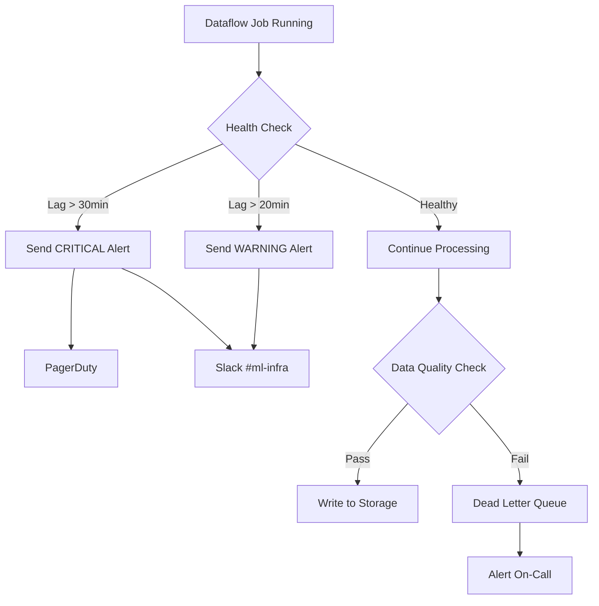

**Automated Monitoring:**

```python
from google.cloud import monitoring_v3
from datetime import datetime, timedelta

class FeatureFreshnessMonitor:
    def __init__(self, project_id):
        self.project_id = project_id
        self.client = monitoring_v3.MetricServiceClient()
    
    def check_freshness_sla(self, feature_group: str, sla_minutes: int = 15):
        """Check if features are within SLA"""
        
        # Query BigQuery for latest feature timestamp
        query = f"""
        SELECT 
            MAX(feature_timestamp) as latest_timestamp
        FROM `{self.project_id}.features.{feature_group}`
        """
        
        result = bq_client.query(query).to_dataframe()
        latest_timestamp = result['latest_timestamp'][0]
        
        # Calculate lag
        lag_minutes = (datetime.utcnow() - latest_timestamp).total_seconds() / 60
        
        # Check SLA
        if lag_minutes > sla_minutes * 2:
            self._send_critical_alert(feature_group, lag_minutes)
        elif lag_minutes > sla_minutes:
            self._send_warning_alert(feature_group, lag_minutes)
        
        # Write metric to Cloud Monitoring
        self._write_metric(
            metric_name='feature_freshness_lag_minutes',
            value=lag_minutes,
            labels={'feature_group': feature_group}
        )
        
        return lag_minutes
    
    def _send_critical_alert(self, feature_group: str, lag_minutes: float):
        """Send critical alert to PagerDuty and Slack"""
        message = f"""
        🚨 CRITICAL: Feature freshness SLA breach
        Feature Group: {feature_group}
        Current Lag: {lag_minutes:.1f} minutes
        Expected SLA: 15 minutes
        
        Runbook: https://wiki.company.com/feature-store/freshness-sla-breach
        """
        
        # Send to PagerDuty
        pagerduty.trigger_incident(
            service_key='feature-store',
            description=f"Feature freshness SLA breach: {feature_group}",
            details=message
        )
        
        # Send to Slack
        slack.send_message(channel='#ml-infra-alerts', message=message)
```

### Automatic Recovery with Retry Logic

```python
from tenacity import retry, stop_after_attempt, wait_exponential
import logging

logger = logging.getLogger(__name__)

class FeatureMaterializationJob:
    @retry(
        stop=stop_after_attempt(3),
        wait=wait_exponential(multiplier=1, min=4, max=60),
        retry_error_callback=lambda retry_state: logger.error(
            f"Failed after {retry_state.attempt_number} attempts"
        )
    )
    def materialize_features(self, date: str, feature_group: str):
        """
        Materialize features with automatic retry
        Idempotent: safe to run multiple times for same date
        """
        logger.info(f"Materializing {feature_group} for {date}")
        
        try:
            # 1. Compute features
            features_df = self._compute_features(date, feature_group)
            
            # 2. Validate
            if not self._validate_features(features_df):
                raise ValueError("Feature validation failed")
            
            # 3. Write to BigQuery (idempotent - partition overwrite)
            table_id = f"{self.project}.features.{feature_group}"
            features_df.to_gbq(
                table_id,
                if_exists='replace',  # Overwrite partition
                partition_col='date'
            )
            
            # 4. Sync to Bigtable for online serving
            self._sync_to_bigtable(features_df, feature_group)
            
            logger.info(f"Successfully materialized {len(features_df)} rows")
            return True
            
        except Exception as e:
            logger.error(f"Materialization failed: {e}")
            self._emit_metric('materialization_failure', 1)
            raise  # Will trigger retry
    
    def _compute_features(self, date: str, feature_group: str):
        """Compute features for date"""
        # Implementation here
        pass
```

### Graceful Degradation Strategy

```python
from enum import Enum
from typing import Optional

class FeatureValueSource(Enum):
    FRESH = "fresh"  # Within SLA
    STALE = "stale"  # Outside SLA but available
    DEFAULT = "default"  # Using default value

class ResilientFeatureServer:
    def __init__(self):
        self.online_store = BigtableClient()
        self.registry = FeatureRegistry()
    
    def get_feature_with_fallback(
        self,
        entity_id: str,
        feature_name: str,
        freshness_sla_seconds: int = 900  # 15 minutes
    ) -> tuple[any, FeatureValueSource]:
        """
        Get feature value with graceful degradation:
        1. Try fresh value (within SLA)
        2. Fallback to stale value (< 2 hours old)
        3. Fallback to default value from registry
        """
        
        # Try to get fresh value
        value, timestamp = self.online_store.get_with_timestamp(
            entity_id, feature_name
        )
        
        if value is not None:
            age_seconds = (datetime.utcnow() - timestamp).total_seconds()
            
            if age_seconds <= freshness_sla_seconds:
                # Fresh value within SLA
                return value, FeatureValueSource.FRESH
            
            elif age_seconds <= 7200:  # 2 hours
                # Stale but acceptable
                self._emit_metric('stale_feature_used', {
                    'feature': feature_name,
                    'age_seconds': age_seconds
                })
                logger.warning(
                    f"Using stale feature {feature_name} "
                    f"(age: {age_seconds/60:.1f} min)"
                )
                return value, FeatureValueSource.STALE
        
        # Fallback to default value
        default_value = self.registry.get_default_value(feature_name)
        self._emit_metric('default_feature_used', {
            'feature': feature_name
        })
        logger.error(
            f"Using default value for {feature_name}: {default_value}"
        )
        
        return default_value, FeatureValueSource.DEFAULT
```

### Backfill Strategy

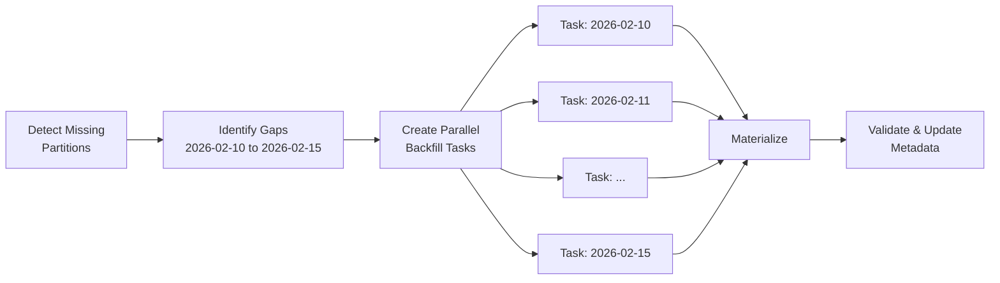

**Airflow DAG for Backfill:**

```python
from airflow import DAG
from airflow.operators.python import PythonOperator
from airflow.utils.task_group import TaskGroup
from datetime import datetime, timedelta

def find_missing_partitions(feature_group, start_date, end_date):
    """Identify missing date partitions"""
    query = f"""
    WITH date_range AS (
        SELECT date
        FROM UNNEST(
            GENERATE_DATE_ARRAY('{start_date}', '{end_date}')
        ) AS date
    ),
    existing_partitions AS (
        SELECT DISTINCT DATE(feature_timestamp) as date
        FROM `project.features.{feature_group}`
    )
    SELECT dr.date
    FROM date_range dr
    LEFT JOIN existing_partitions ep ON dr.date = ep.date
    WHERE ep.date IS NULL
    ORDER BY dr.date
    """
    
    result = bq_client.query(query).to_dataframe()
    return result['date'].tolist()

def materialize_partition(feature_group, date, **context):
    """Materialize a single partition"""
    job = FeatureMaterializationJob()
    job.materialize_features(date=str(date), feature_group=feature_group)

# DAG definition
with DAG(
    'backfill_features',
    start_date=datetime(2026, 1, 1),
    schedule_interval=None,  # Manual trigger
    catchup=False,
    max_active_runs=1
) as dag:
    
    feature_group = 'user_engagement'
    start_date = '2026-02-10'
    end_date = '2026-02-15'
    
    # Find gaps
    find_gaps = PythonOperator(
        task_id='find_missing_partitions',
        python_callable=find_missing_partitions,
        op_kwargs={
            'feature_group': feature_group,
            'start_date': start_date,
            'end_date': end_date
        }
    )
    
    # Parallel backfill (with concurrency limit)
    with TaskGroup('backfill_tasks', prefix_group_id=False) as backfill_group:
        # This will create tasks dynamically based on missing dates
        missing_dates = find_missing_partitions(feature_group, start_date, end_date)
        
        for date in missing_dates:
            PythonOperator(
                task_id=f'backfill_{date}',
                python_callable=materialize_partition,
                op_kwargs={
                    'feature_group': feature_group,
                    'date': date
                },
                pool='backfill_pool',  # Limit concurrent backfills
                priority_weight=5  # Lower priority than real-time jobs
            )
    
    find_gaps >> backfill_group
```

### Runbook for Common Failures

**Example Runbook Entry:**

```markdown
## Runbook: BigQuery Quota Exceeded

**Symptoms:**
- Dataflow job stuck with error "Quota exceeded"
- Feature freshness SLA alerts firing
- No new data in BigQuery tables

**Detection:**
- Alert: "BigQuery quota exceeded for project X"
- Dataflow job status: FAILED
- Cloud Monitoring metric: bigquery_quota_usage > 90%

**Resolution Steps:**

1. **Immediate (5 minutes):**
   ```bash
   # Request temporary quota increase
   gcloud alpha services quota update \
     --service=bigquery.googleapis.com \
     --consumer=projects/my-project \
     --metric=bigquery.googleapis.com/quota/query/usage \
     --value=200000 \
     --force
   ```

2. **Short-term (10 minutes):**
   - Throttle non-critical batch jobs
   - Pause low-priority feature groups
   - Enable query caching more aggressively

3. **Backfill (30 minutes):**
   ```bash
   # Identify missing partitions
   python scripts/find_gaps.py --feature-group=user_engagement \
     --start-date=2026-02-10 --end-date=2026-02-16
   
   # Trigger backfill DAG
   gcloud composer environments run feature-env \
     --location=us-central1 \
     dags trigger -- backfill_features \
     --conf '{"feature_group": "user_engagement", "dates": ["2026-02-10", "2026-02-11"]}'
   ```

4. **Prevention:**
   - Add quota monitoring dashboard
   - Implement rate limiting in job scheduler
   - Set up quota alerts at 80% threshold

**Post-Mortem:**
- Document root cause
- Update monitoring thresholds
- Add regression test
```

---

## Migration Strategy

### Phased Migration Approach

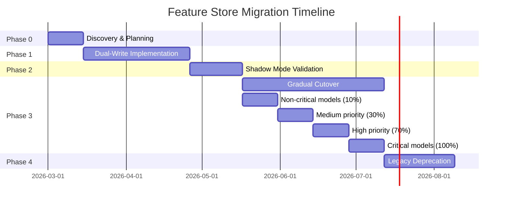

### Phase 1: Dual-Write Pattern

**Implementation:**

```python
from typing import Dict, Any
import logging

logger = logging.getLogger(__name__)

class DualWriteFeatureStore:
    """
    Write to both legacy and new feature stores
    Maintains backward compatibility while building confidence
    """
    
    def __init__(self, legacy_store, new_store, config_manager):
        self.legacy = legacy_store
        self.new = new_store
        self.config = config_manager
        self.metrics = MetricsClient()
    
    def write_features(
        self,
        entity_id: str,
        feature_group: str,
        features: Dict[str, Any]
    ):
        """
        Write to both stores with error handling
        Legacy write MUST succeed, new store write is best-effort
        """
        
        # 1. Always write to legacy (maintain safety)
        try:
            self.legacy.write(entity_id, feature_group, features)
            self.metrics.increment('legacy_write_success')
        except Exception as e:
            logger.error(f"Legacy write failed: {e}")
            self.metrics.increment('legacy_write_failure')
            raise  # Critical - must succeed
        
        # 2. Conditionally write to new store
        if self.config.is_feature_group_migrating(feature_group):
            try:
                self.new.write(entity_id, feature_group, features)
                self.metrics.increment('new_store_write_success')
                
                # Async validation (don't block)
                asyncio.create_task(
                    self._validate_write_consistency(
                        entity_id, feature_group, features
                    )
                )
                
            except Exception as e:
                # Don't fail the request - log and monitor
                logger.warning(f"New store write failed: {e}")
                self.metrics.increment('new_store_write_failure')
                # Continue - legacy write succeeded
    
    async def _validate_write_consistency(
        self,
        entity_id: str,
        feature_group: str,
        expected_features: Dict
    ):
        """Validate that both stores have same data"""
        
        # Wait a bit for writes to propagate
        await asyncio.sleep(1)
        
        # Read from both
        legacy_data = await self.legacy.read(entity_id, feature_group)
        new_data = await self.new.read(entity_id, feature_group)
        
        # Compare
        if not self._features_match(legacy_data, new_data, tolerance=1e-6):
            logger.error(
                f"Data mismatch for {entity_id}/{feature_group}: "
                f"legacy={legacy_data}, new={new_data}"
            )
            self.metrics.increment('dual_write_mismatch')
```

### Phase 2: Shadow Mode Validation

```python
class ShadowReadValidator:
    """
    Read from both stores in parallel
    Serve from legacy, validate against new
    """
    
    def __init__(self, legacy_store, new_store):
        self.legacy = legacy_store
        self.new = new_store
        self.metrics = MetricsClient()
    
    async def get_features_with_validation(
        self,
        entity_id: str,
        feature_list: List[str]
    ) -> Dict[str, Any]:
        """
        Primary: Read from legacy (serve to user)
        Shadow: Read from new (compare and log)
        """
        
        # Parallel reads
        legacy_task = asyncio.create_task(
            self.legacy.get_features(entity_id, feature_list)
        )
        new_task = asyncio.create_task(
            self.new.get_features(entity_id, feature_list)
        )
        
        # Wait for legacy (primary)
        legacy_result = await legacy_task
        
        # Shadow read (don't block response)
        asyncio.create_task(
            self._compare_and_log(legacy_task, new_task, entity_id)
        )
        
        return legacy_result  # Return legacy immediately
    
    async def _compare_and_log(
        self,
        legacy_task,
        new_task,
        entity_id: str
    ):
        """Compare results and log discrepancies"""
        
        try:
            legacy_result = await legacy_task
            new_result = await new_task
            
            # Compare
            discrepancies = self._find_differences(
                legacy_result,
                new_result,
                tolerance=1e-6
            )
            
            if discrepancies:
                logger.warning(
                    f"Feature mismatch for {entity_id}: {discrepancies}"
                )
                self.metrics.increment('feature_mismatch', {
                    'entity_id': entity_id,
                    'num_mismatches': len(discrepancies)
                })
                
                # Store for analysis
                self._store_discrepancy(entity_id, discrepancies)
            else:
                self.metrics.increment('feature_match')
                
        except Exception as e:
            logger.error(f"Shadow read comparison failed: {e}")
```

### Phase 3: Gradual Cutover

**Feature Flag System:**

```python
from typing import Optional

class FeatureFlagManager:
    """Manage gradual rollout to new feature store"""
    
    def __init__(self, config_store):
        self.config = config_store
    
    def should_use_new_store(
        self,
        model_id: str,
        user_id: Optional[str] = None
    ) -> bool:
        """
        Determine if request should use new store
        Based on model priority and rollout percentage
        """
        
        rollout_config = self.config.get_rollout_config(model_id)
        
        if not rollout_config['enabled']:
            return False
        
        # Check if model is in rollout
        if rollout_config['percentage'] == 100:
            return True
        
        # Deterministic hash-based rollout
        if user_id:
            hash_value = int(hashlib.md5(user_id.encode()).hexdigest(), 16)
            return (hash_value % 100) < rollout_config['percentage']
        
        return False

# Rollout configuration
rollout_config = {
    "fraud_detection_model": {
        "enabled": True,
        "percentage": 100,  # Critical model, fully migrated
        "priority": "critical"
    },
    "recommendation_model_v1": {
        "enabled": True,
        "percentage": 10,  # Canary at 10%
        "priority": "low"
    },
    "search_ranking_model": {
        "enabled": False,  # Not ready yet
        "percentage": 0,
        "priority": "high"
    }
}
```

**Automated Rollback:**

```python
class AutomatedRollbackMonitor:
    """Monitor performance and rollback on regression"""
    
    def __init__(self):
        self.metrics = MetricsClient()
        self.pagerduty = PagerDutyClient()
        self.config = ConfigManager()
    
    def check_health_metrics(self, model_id: str):
        """Check if migration caused regression"""
        
        # Get metrics for last hour
        current_metrics = self.metrics.get_metrics(
            model_id=model_id,
            time_range='1h'
        )
        
        # Get baseline (before migration)
        baseline_metrics = self.metrics.get_metrics(
            model_id=model_id,
            time_range='1h',
            end_time=migration_start_time
        )
        
        # Check for regressions
        checks = {
            'model_performance': (
                current_metrics['auc'] < baseline_metrics['auc'] * 0.98
            ),
            'error_rate': (
                current_metrics['error_rate'] > baseline_metrics['error_rate'] * 2
            ),
            'latency': (
                current_metrics['p99_latency'] > baseline_metrics['p99_latency'] * 1.2
            )
        }
        
        if any(checks.values()):
            self._trigger_rollback(model_id, checks)
    
    def _trigger_rollback(self, model_id: str, failed_checks: Dict):
        """Automatically rollback to legacy store"""
        
        logger.critical(
            f"ROLLBACK triggered for {model_id}: {failed_checks}"
        )
        
        # Update config to disable new store
        self.config.update_rollout_config(model_id, {
            'enabled': False,
            'percentage': 0
        })
        
        # Alert team
        self.pagerduty.trigger_incident(
            service='feature-store-migration',
            description=f"Auto-rollback triggered for {model_id}",
            details=failed_checks
        )
        
        # Pause migration for this model
        self.config.set_migration_paused(model_id, True)
```

### Migration Success Criteria

**Validation Metrics:**

| Metric | Target | Status Check Frequency |
|--------|--------|----------------------|
| Data consistency rate | >99.9% | Hourly |
| Latency (p99) | <20ms | Every 5 min |
| Error rate | <0.01% | Every 5 min |
| Model performance (AUC) | No regression >2% | Daily |
| Feature coverage | 100% | Hourly |

**Go/No-Go Decision Points:**

```python
class MigrationGatekeeper:
    """Decide if migration can proceed to next phase"""
    
    def can_proceed_to_phase(self, phase: int) -> tuple[bool, str]:
        """
        Check if migration can proceed to next phase
        Returns: (can_proceed, reason)
        """
        
        checks = {
            1: [  # Dual-write phase
                ('New store writes succeed >99%', self._check_write_success),
                ('No data loss detected', self._check_data_integrity),
            ],
            2: [  # Shadow mode
                ('Data consistency >99.9%', self._check_consistency),
                ('Latency <20ms p99', self._check_latency),
            ],
            3: [  # Cutover
                ('7 days stable in shadow mode', self._check_stability),
                ('All validation tests pass', self._check_validation),
                ('Team sign-off', self._check_team_approval),
            ]
        }
        
        for check_name, check_fn in checks.get(phase, []):
            passed, details = check_fn()
            if not passed:
                return False, f"Failed: {check_name} - {details}"
        
        return True, "All checks passed"
```

---

## Success Metrics

### Technical Performance Metrics

**Reliability (Most Critical):**

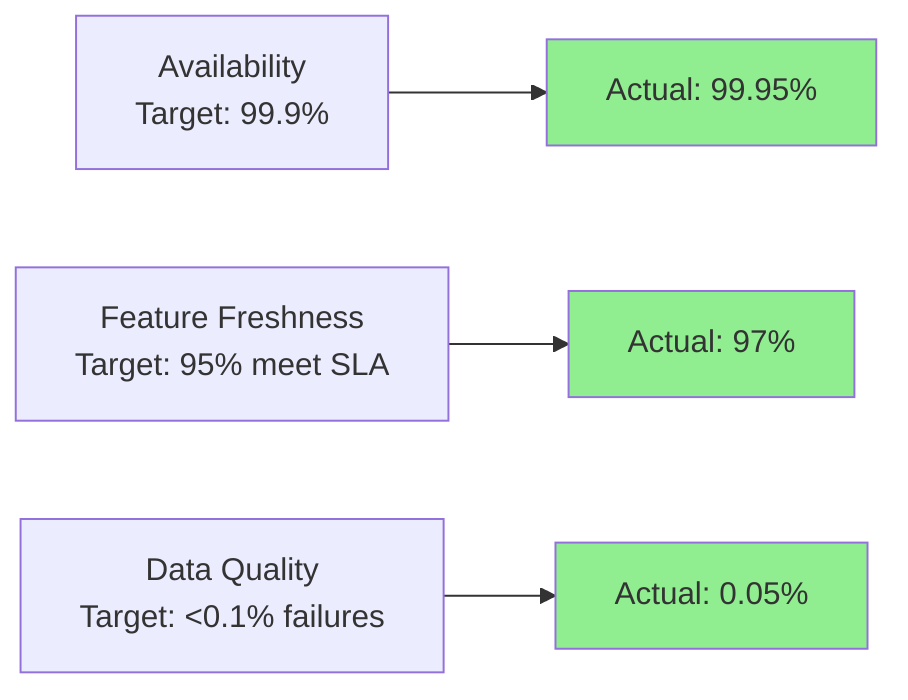

**Performance Metrics:**

| Metric | Target | Actual (Month 6) | Status |
|--------|--------|------------------|--------|
| Online serving p99 latency | <20ms | 18ms | ✅ |
| Batch processing time (10TB) | <4 hours | 3.5 hours | ✅ |
| Cache hit rate | >80% | 82% | ✅ |
| Point-in-time correctness | 100% | 100% | ✅ |

### Developer Productivity Metrics

**Time to Value:**

```python
# Before feature store
time_to_create_feature = 2_weeks  # Manual pipeline setup
time_to_discover_features = "unknown"  # No catalog
time_to_training_dataset = 2_days  # Manual SQL joins

# After feature store
time_to_create_feature = 2_days  # API + config
time_to_discover_features = 10_minutes  # Search UI
time_to_training_dataset = 30_minutes  # Auto point-in-time join
```

**Adoption Metrics:**

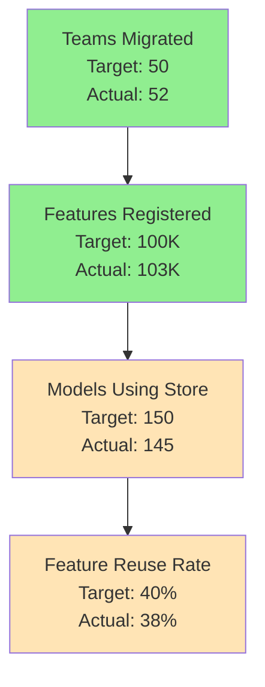

### Business Value Metrics

**Cost Efficiency:**

```python
# Before (scattered pipelines across teams)
infrastructure_cost = 30_000  # per month
engineer_time = 5 * 150_000 / 12  # 5 FTE maintaining pipelines
total_cost_before = infrastructure_cost + engineer_time  # ~$92K/month

# After (centralized feature store)
infrastructure_cost = 20_000  # per month (optimized)
engineer_time = 2 * 150_000 / 12  # 2 FTE maintaining platform
total_cost_after = infrastructure_cost + engineer_time  # ~$45K/month

savings = total_cost_before - total_cost_after  # $47K/month (~50% reduction)
```

**ML Model Improvements:**

- **10+ models** show >2% accuracy improvement (better features)
- **Feature experimentation velocity:** 3x faster
- **Time-to-production for new models:** 50% reduction

### Operational Excellence

**Incidents & MTTR:**

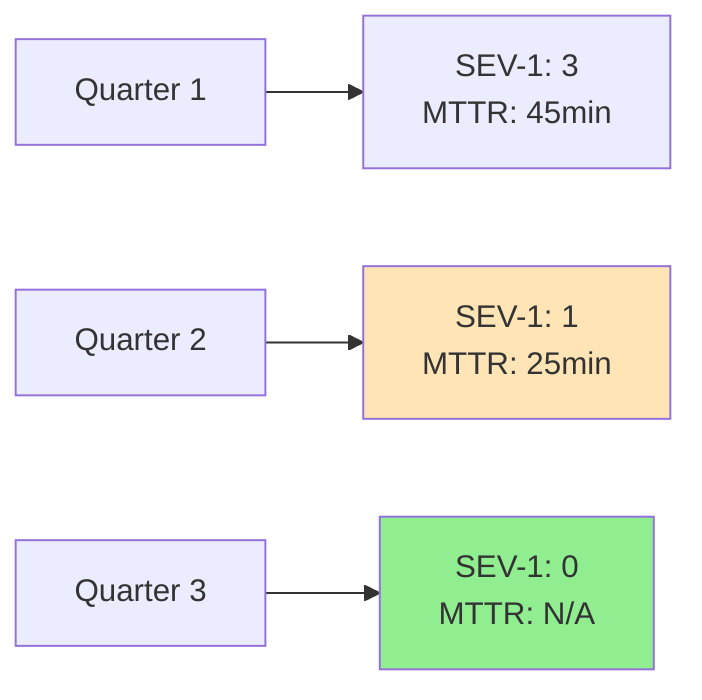

**Target:** <2 SEV-1 incidents per quarter, MTTR <30 minutes

### User Satisfaction (NPS)

**Quarterly Survey Results:**

| Question | Target | Q1 | Q2 | Q3 | Q4 |
|----------|--------|----|----|----|----|
| Net Promoter Score | >50 | 45 | 58 | 62 | 68 |
| "Easy to use" | >80% | 75% | 82% | 85% | 88% |
| "Can find features I need" | >75% | 70% | 78% | 80% | 82% |
| "Saves me time" | >80% | 85% | 87% | 90% | 91% |

### Executive Dashboard

```
Feature Store Health - Month 6
━━━━━━━━━━━━━━━━━━━━━━━━━━━━━━━━━━━━━━━━━━━━
ADOPTION
├─ Active Users (ML Engineers)    215  ✓ (target: 200)
├─ Features Registered            103K ✓ (target: 100K)
├─ Models Using Store             145  ⚠ (target: 150)
└─ Feature Reuse Rate             38%  ⚠ (target: 40%)

PERFORMANCE
├─ Availability                   99.95% ✓ (target: 99.9%)
├─ P99 Latency                    18ms   ✓ (target: <20ms)
├─ Features Meeting SLA           97%    ✓ (target: 95%)
└─ Data Quality Pass Rate         99.95% ✓ (target: >99.9%)

BUSINESS VALUE
├─ Infrastructure Cost/month      $20K   ✓ (vs $30K before)
├─ Cost per Feature              $0.19  ✓ (target: <$2)
├─ Engineer Time Saved/quarter   1200hr ✓ (target: 1000hr)
└─ Models with >2% improvement   12     ✓ (target: 10)

USER SATISFACTION
├─ Net Promoter Score             68    ✓ (target: >50)
├─ Feature Store "Easy to use"    88%   ✓ (target: >80%)
└─ "Saves me time"               91%   ✓ (target: >80%)
━━━━━━━━━━━━━━━━━━━━━━━━━━━━━━━━━━━━━━━━━━━━
Overall Health: 🟢 HEALTHY (20/22 metrics meeting targets)
```

---

## Conclusion

This feature store design provides:

1. **Scalability:** Handles 100K+ features at 100K QPS with <20ms latency
2. **Reliability:** 99.9% availability with automated failure recovery
3. **Cost-Efficiency:** ~$20K/month with 50% cost reduction vs status quo
4. **Developer Productivity:** 3x faster feature development, 10min feature discovery
5. **Operational Excellence:** <2 SEV-1 incidents/quarter, <30min MTTR
6. **Business Value:** 10+ models with >2% improvement, 1200hr/quarter saved

The architecture leverages GCP's managed services (BigQuery, Bigtable, Dataflow) to minimize operational burden while maintaining flexibility for future enhancements like automated feature engineering, real-time transformations, and feature marketplace capabilities.

---

## Appendix: Key Design Decisions

### Why These Choices?

**BigQuery for Offline Store:**
- Native point-in-time join support
- Excellent for analytical queries
- Columnar storage optimized for ML
- Serverless and auto-scaling

**Bigtable for Online Store:**
- Consistent sub-10ms latency at scale
- Proven at Google-scale internally
- Better than Cloud SQL for 100K+ QPS
- Better than Spanner when strong consistency not needed

**Redis Cache Layer:**
- 80/20 rule: 20% features → 80% requests
- Sub-millisecond latency
- 80% cost reduction on Bigtable reads

**Trade-offs Considered:**
- **Consistency vs Latency:** Eventual consistency acceptable for ML
- **Cost vs Performance:** Tiered storage balances both
- **Build vs Buy:** GCP-native reduces ops burden vs OSS (Feast)
- **Flexibility vs Simplicity:** Support transformations but keep simple

---

*End of Document*
