# ML System Design: Harmful Content Detection (Trust & Safety)

## Interview Answer — Tailored for Roblox, Senior ML Infrastructure Engineer

---

## 🎯 Role Calibration

| Dimension | Assessment |
|-----------|-----------|
| **Role Title** | Senior ML Infrastructure Engineer (Trust & Safety) |
| **Role Type** | **ML Infrastructure** — building scalable, reliable, and high-performance infra for content safety ML systems |
| **Domain** | Multimodal harmful content detection: text, images, 3D assets, audio, in-experience behavior |
| **Detection Modes** | Pre-publish (asset upload review) + real-time in-session (chat, behavior) |
| **Scale Signals** | Hundreds of millions of users, significant under-13 population (COPPA), tens of millions daily active |
| **Depth Split** | **70% Infrastructure** (pipelines, serving, feature stores, orchestration, SLOs, cost) · **20% Domain Context** (moderation taxonomy, safety policy, regulatory) · **10% Model Overview** (architectures at high level) |

> *"I'm framing this as an ML Infra answer — my job is to build the platform that Trust & Safety ML engineers and data scientists ship models on. I'll go deep on serving topology, pipeline orchestration, latency vs. recall trade-offs, and operational excellence. I'll cover enough modeling to show domain fluency but won't spend interview time on loss function design."*

---

## Key Differences from Ad Recommendation Infra

> *"Before diving in, let me highlight the fundamental infra differences between ads and T&S content detection — these shape every architectural decision."*

| Dimension | Ad Recommendations | Harmful Content Detection |
|-----------|-------------------|--------------------------|
| **Failure mode** | Showing a bad ad → lost revenue | Missing harmful content → **child safety risk, regulatory violation, brand damage** |
| **Optimization target** | Maximize revenue (eCPM) | Maximize recall at high precision; minimize false negatives |
| **Latency tolerance** | ~100 ms (user waits for ad) | **Pre-publish: seconds to minutes acceptable; Real-time chat: < 50 ms; Behavior: near-real-time (seconds)** |
| **Modalities** | Structured features (user, ad, context) | **Multimodal: text, image, audio, 3D mesh, behavioral sequences** |
| **Model count** | 1–3 models (pCTR, pCVR, quality) | **10–30+ models** (one per harm category × modality, plus ensemble) |
| **Feedback loop** | Clear labels (click / no click) | **Ambiguous labels, human review required, adversarial users evolving tactics** |
| **Regulatory** | Ad standards (FTC) | **COPPA, DSA (EU), Online Safety Act (UK), CSAM reporting obligations** |
| **Adversarial pressure** | Low (advertisers want clicks) | **High — bad actors actively evade detection** |

---

## 1 · Clarification Round

| # | My Question | Interviewer's Answer (Assumed) |
|---|-------------|-------------------------------|
| 1 | **Harm taxonomy** — What categories are we detecting? Is there a tiered severity system? | Tiered: **Tier 0 (immediate block):** CSAM, terrorism, imminent violence. **Tier 1 (block + review):** hate speech, bullying, sexual content. **Tier 2 (flag for review):** misinformation, scams, borderline content. |
| 2 | **Modalities** — Which modalities are in production today, and which are greenfield? | Text and image classifiers exist but are monolithic. Audio, 3D asset, and behavioral detection are greenfield. |
| 3 | **Scale** — What's the volume per modality? | Text: ~5B chat messages/day. Images: ~200M image uploads/day (decals, thumbnails). Audio: ~50M voice chat minutes/day. 3D assets: ~2M uploads/day. Behavioral events: ~100B/day. |
| 4 | **Latency requirements** — What are the SLAs per detection point? | Pre-publish asset review: < 30 seconds. Real-time chat: < 50 ms. Voice chat: < 500 ms (streaming). Behavior detection: < 5 seconds for session-level signals. |
| 5 | **Human review** — Is there an in-house moderation team, and how large? | ~500 human moderators, handling ~2M review tasks/day. Queue prioritization is critical. |
| 6 | **CSAM obligations** — Do we hash-match (PhotoDNA) or also use ML classifiers? | Both: hash-matching (PhotoDNA/NCMEC) is the first layer; ML classifier is the second layer. Hash match is handled by a partner team; we own the ML classifier infra. |
| 7 | **Adversarial adaptation** — How fast do bad actors evolve? | Fast. New evasion tactics (homoglyphs, steganography, Leetspeak, image perturbations) appear weekly. We need rapid model update cycles. |
| 8 | **False positive cost** — How much do we care about over-moderation? | Very much for Tier 2 — removing legitimate content hurts creator trust. For Tier 0, we accept higher FP rates to maximize recall. |

---

## 2 · High-Level Architecture

> *"The key insight is that content detection is not a single model — it's an orchestrated pipeline of modality-specific classifiers feeding into a policy decision engine. Let me draw the full system."*


**Legend:** 🔵 Blue = ML Infra team owns · 🟡 Yellow = Policy team owns (we provide the platform) · 🔴 Red = Enforcement actions · 🟢 Green = Human review loop

---

## 3 · Deep Dives

### Deep Dive 1: Multi-Model Serving Orchestration

> *"The biggest infra difference from ads: we're not running 1 model — we're orchestrating 10–30+ models per content item, across different modalities, with different latency budgets. This is the core infra challenge."*

#### The Orchestration Problem

A single image upload might need to pass through:
1. PhotoDNA hash match (~5 ms)
2. CSAM ML classifier (~15 ms)
3. Nudity/sexual content classifier (~15 ms)
4. Violence/gore classifier (~15 ms)
5. OCR → text extraction → text toxicity classifier (~50 ms)
6. Hate symbol detector (~10 ms)

Running all sequentially = ~110 ms. Running all in parallel = ~50 ms (bounded by OCR path). But some models are conditional (skip OCR if no text detected). This requires a **DAG-based orchestration engine**.

#### Serving Architecture: Model DAG Executor

```mermaid
flowchart LR
    subgraph DAGExecutor["Model DAG Executor"]
        direction TB
        IN["Content<br/>Input"]
        
        subgraph Parallel1["Parallel Stage 1"]
            M1["Hash Match<br/>(5ms)"]
            M2["CSAM Classifier<br/>(15ms)"]
            M3["Nudity Classifier<br/>(15ms)"]
            M4["Violence Classifier<br/>(15ms)"]
            M5["OCR Extraction<br/>(30ms)"]
            M6["Hate Symbol<br/>Detector (10ms)"]
        end
        
        subgraph Conditional["Conditional Stage 2"]
            M7["Text Toxicity<br/>(if OCR found text)<br/>(20ms)"]
        end
        
        AGG["Score<br/>Aggregator"]
    end

    subgraph Infra["Serving Infra"]
        T1["Triton Pool A<br/>(GPU — vision models)"]
        T2["Triton Pool B<br/>(GPU — text models)"]
        T3["CPU Pool<br/>(hash match, OCR)"]
    end

    IN --> Parallel1
    Parallel1 --> Conditional
    Conditional --> AGG

    M1 -.-> T3
    M2 -.-> T1
    M3 -.-> T1
    M4 -.-> T1
    M5 -.-> T3
    M6 -.-> T1
    M7 -.-> T2

    style T1 fill:#1a73e8,color:#fff
    style T2 fill:#1a73e8,color:#fff
    style T3 fill:#1a73e8,color:#fff
```



#### Key Design Decisions

**1. DAG config, not code** — Each content type (image, text, audio, 3D) has a DAG defined in YAML. Adding a new classifier = adding a node to the DAG config + deploying the model. No code changes to the orchestrator. This is critical for model velocity.

```yaml
# Example: image_moderation_dag.yaml
stages:
  - parallel:
      - model: hash_match_v3
        pool: cpu
        timeout_ms: 20
        short_circuit: true  # If match → skip everything, return Tier 0
      - model: csam_classifier_v2
        pool: gpu_vision
        timeout_ms: 30
      - model: nudity_v4
        pool: gpu_vision
        timeout_ms: 30
      - model: violence_v3
        pool: gpu_vision
        timeout_ms: 30
      - model: ocr_extractor_v1
        pool: cpu
        timeout_ms: 50
  - conditional:
      - model: text_toxicity_v6
        pool: gpu_text
        condition: "ocr_extractor_v1.text_detected == true"
        timeout_ms: 30
  - aggregator: weighted_max
```

**2. Short-circuit evaluation** — For Tier 0 harms (CSAM, terrorism), if any single classifier fires with high confidence, skip remaining models and immediately block. This saves GPU cycles and reduces latency for the most critical cases.

**3. Heterogeneous compute pools** — Vision models run on GPU (A100/T4), hash matching and OCR run on CPU, text models on separate GPU pool. This prevents a CPU-bound task (OCR) from starving GPU-bound classifiers.

**4. Timeout + fallback per model** — Each model node has a timeout. If a model times out:
- For Tier 0 classifiers: **fail-closed** (block the content, queue for human review)
- For Tier 2 classifiers: **fail-open** (allow content, log for async review)

This is a fundamental difference from ads — in ads, timeout means show no ad (fail-open). In safety, some models must fail-closed.

#### Latency Budgets by Content Type

| Content Type | Detection Path | p50 (ms) | p99 (ms) | SLA |
|-------------|---------------|----------|----------|-----|
| **Text chat message** | Text ensemble (toxicity + grooming + PII) | 8 | 30 | < 50 ms |
| **Image upload** | Hash match ∥ (CSAM + nudity + violence + hate) → conditional OCR+text | 25 | 80 | < 200 ms (pre-publish, non-blocking to user) |
| **Audio (voice chat)** | Streaming ASR → text classifier on chunks | 200 | 400 | < 500 ms per 5s chunk |
| **3D asset upload** | Multi-view render → image pipeline per view | 5,000 | 15,000 | < 30 s (async, user sees "processing") |
| **Behavioral** | Flink session aggregation → anomaly model | 1,000 | 4,000 | < 5 s |

---

### Deep Dive 2: Multimodal Data Pipeline & Feature Store

> *"Each modality has a fundamentally different data pipeline. The infra challenge is building a unified platform that handles all of them without becoming a spaghetti of custom pipelines."*

```mermaid
flowchart TB
    subgraph Raw["Raw Data Ingestion"]
        R1["Kafka — Text<br/>Events"]
        R2["Object Store — <br/>Images (S3)"]
        R3["Kafka — Audio<br/>Chunks"]
        R4["Object Store —<br/>3D Assets (S3)"]
        R5["Kafka —<br/>Behavioral Events"]
    end

    subgraph Processing["Modality-Specific Processing"]
        P1["Text<br/>Tokenization +<br/>Embedding"]
        P2["Image Resize +<br/>Normalize +<br/>Perceptual Hash"]
        P3["Audio → Mel<br/>Spectrogram +<br/>ASR Transcription"]
        P4["3D → Multi-View<br/>Rendering<br/>(8 canonical views)"]
        P5["Behavioral<br/>Session Window<br/>Aggregation (Flink)"]
    end

    subgraph FeatureStore["Unified Feature Store"]
        FS1["Online Store<br/>(Redis)<br/>User reputation scores<br/>Session context<br/>Real-time counters"]
        FS2["Offline Store<br/>(Iceberg)<br/>Training datasets<br/>Label history<br/>Feature archives"]
        FS3["Embedding Store<br/>(Milvus/Pinecone)<br/>Content embeddings<br/>for similarity search"]
    end

    subgraph Consumers["Consumers"]
        C1["Real-Time<br/>Classifiers"]
        C2["Training<br/>Pipeline"]
        C3["Similarity<br/>Search<br/>(known-bad matching)"]
        C4["Human Review<br/>Queue"]
    end

    R1 --> P1
    R2 --> P2
    R3 --> P3
    R4 --> P4
    R5 --> P5

    P1 --> FS1
    P1 --> FS2
    P2 --> FS2
    P2 --> FS3
    P3 --> FS2
    P4 --> FS2
    P5 --> FS1

    FS1 --> C1
    FS2 --> C2
    FS3 --> C3
    FS1 --> C4

    style FS1 fill:#1a73e8,color:#fff
    style FS2 fill:#1a73e8,color:#fff
    style FS3 fill:#1a73e8,color:#fff
```



#### Feature Categories for Content Safety

| Feature Category | Examples | Storage | Freshness |
|-----------------|----------|---------|-----------|
| **User reputation** | Historical violation count, account age, trust score, friend graph density | Redis (online) | Real-time (Flink counters) |
| **Content signals** | Text length, image resolution, asset complexity, audio duration | Computed at ingestion | Per-request |
| **Contextual** | Game genre, chat room size, time of day, user age bracket | Redis (online) | Batch (daily) + real-time |
| **Cross-modal** | User's recent text toxicity avg, image violation history | Redis (online) | Streaming (Flink, 5-min windows) |
| **Embedding similarity** | Distance to known-bad content clusters | Vector DB (Milvus) | Batch index rebuild (daily) + real-time query |

#### The Embedding Store — Unique to Safety

> *"This is an infra component that doesn't exist in ads. We maintain a vector database of known-bad content embeddings. When new content arrives, we compute its embedding and search for nearest neighbors among known violations. This catches evasion variants (slightly modified CSAM, Leetspeak variations of slurs, etc.)."*

| Parameter | Value |
|-----------|-------|
| Embedding dimensionality | 512 (CLIP-style for images, sentence-transformers for text) |
| Index size | ~10M known-bad embeddings (images) + ~50M (text) |
| Query latency | p99 < 10 ms (HNSW index) |
| Index rebuild | Daily full rebuild + hourly incremental additions |
| Similarity threshold | Tuned per harm category (e.g., CSAM: cosine > 0.85, hate speech: cosine > 0.90) |

---

### Deep Dive 3: Training Pipeline — Label Acquisition & Adversarial Retraining

> *"Training for safety is fundamentally different from ads. In ads, you have clean labels (clicked or didn't). In safety, labels are expensive, noisy, and adversarial. The infra must support this."*


#### Key Infra Differences from Ads Training

**1. Stratified sampling per harm category** — Unlike ads (downsample negatives uniformly), safety requires careful per-category sampling. CSAM may have 0.001% prevalence but needs the highest recall. The training pipeline maintains per-category sampling ratios in config, not code.

| Harm Category | Prevalence | Sample Ratio | Target Recall |
|---------------|-----------|--------------|---------------|
| CSAM | 0.001% | 100× oversample positives | ≥ 99.5% |
| Nudity / Sexual | 0.5% | 10× oversample | ≥ 98% |
| Violence / Gore | 0.3% | 10× oversample | ≥ 97% |
| Hate Speech | 1.2% | 5× oversample | ≥ 95% |
| Bullying / Harassment | 2.0% | 3× oversample | ≥ 93% |
| Scams / Spam | 3.0% | 2× oversample | ≥ 90% |

**2. Regression test suite (Golden Set)** — Before any model ships, it must achieve 100% recall on a curated "golden set" of ~10K known-bad items (confirmed violations across all categories). This is a hard gate — no exceptions. The infra maintains this golden set as a versioned dataset in Iceberg with strict access controls (especially for CSAM — only hash comparisons, never raw content stored in training infra).

**3. Adversarial evaluation** — A red team generates evasion attempts (homoglyphs, adversarial patches, Leetspeak, whitespace injection). The training pipeline includes an adversarial eval stage that benchmarks the new model against a refreshed evasion corpus. If bypass rate > 5%, the model is rejected.

**4. Rapid retrain cycle** — Bad actors adapt weekly. The training pipeline must support:
- **Daily**: Incremental fine-tune on last 24h of human-labeled data
- **Weekly**: Full retrain with updated adversarial corpus
- **Emergency (< 4 hours)**: Hotfix retrain when a new evasion vector is discovered (e.g., new Leetspeak pattern goes viral). This uses a pre-warmed GPU cluster with priority scheduling in K8s.

#### Training Scale

| Metric | Text Models | Vision Models | Audio Models |
|--------|------------|--------------|-------------|
| Training data | ~500M labeled messages | ~50M labeled images | ~10M labeled audio clips |
| Model size | ~350M params (BERT-large class) | ~300M params (ViT-L class) | ~100M params (Whisper-small + classifier) |
| Hardware | 4× A100 | 8× A100 | 4× A100 |
| Full retrain time | ~3 hours | ~6 hours | ~2 hours |
| Emergency hotfix | ~30 min (warm start, last layer only) | ~1 hour | ~30 min |

---

### Deep Dive 4: Monitoring, Alerting & Operational Excellence for Safety

> *"Monitoring for safety is higher stakes than ads. A monitoring gap doesn't just lose revenue — it means harmful content reaches children. The SLO framework reflects this."*

#### SLO Framework

| SLO | Target | Rationale | Alert Threshold |
|-----|--------|-----------|-----------------|
| **Tier 0 classifier availability** | **99.99%** | CSAM/terrorism detection cannot go down | < 99.95% over 1 min → P1 page |
| **Tier 1 classifier availability** | 99.95% | High severity, brief outage tolerable | < 99.9% over 5 min |
| **Tier 2 classifier availability** | 99.9% | Can queue for async review | < 99.5% over 15 min |
| **Text classification p99 latency** | < 50 ms | In-line with chat delivery | > 40 ms sustained → warning |
| **Image classification p99 latency** | < 200 ms | Pre-publish, non-blocking | > 150 ms sustained → warning |
| **Training pipeline SLA** | 99.5% on-time daily | Model freshness | Not started by deadline → P2 |
| **Emergency retrain SLA** | < 4 hours from trigger | New evasion vector response | > 2 hours elapsed → P1 escalation |
| **Human review queue latency** | p50 < 2 hours for Tier 1 | Moderator SLA | Backlog > 50K items → alert |
| **Recall regression** | 0 regressions on golden set | Safety-critical | Any golden set miss → auto-rollback + P1 |

#### Safety-Specific Monitoring (Beyond Standard ML Metrics)

| Monitor | What It Catches | Implementation |
|---------|----------------|----------------|
| **Category-level recall tracking** | Per-harm-category recall degradation (e.g., hate speech recall drops but overall AUC looks fine) | Log predictions + human review verdicts; compute daily recall per category |
| **Evasion rate tracking** | Rising rate of "detected by human but missed by model" | Compare model predictions on human-reviewed queue items; alert if miss rate > threshold |
| **Score distribution shift** | Adversarial drift or data distribution change | Hourly KL-divergence of model score distributions vs. trailing 7-day baseline |
| **Cross-modality correlation** | Users evading text detection by embedding text in images | Monitor OCR extraction rate on images from users flagged for text violations |
| **False positive impact** | Over-moderation harming creator trust | Track appeal rate and appeal overturn rate per classifier; alert if overturn rate > 10% |
| **Regulatory compliance** | NCMEC reporting SLA, DSA response times | SLA counters on CSAM report pipeline; alert if report not filed within 24h of detection |

#### Incident Response: Safety-Specific Playbook

| Scenario | Severity | Response |
|----------|----------|----------|
| **Tier 0 classifier down** | P1 — immediate | Fail-closed: block all content in affected modality + route to human review. Page on-call. Restore from last known good model within 15 min. |
| **New evasion vector discovered** | P2 → P1 if widespread | Trigger emergency retrain pipeline. Deploy regex/rule-based hotfix within 1 hour as stopgap. Emergency model in < 4 hours. |
| **Recall regression detected** | P1 | Auto-rollback to previous model. Root-cause: check training data quality, feature pipeline, and for data poisoning. |
| **Human review queue backlog** | P2 | Auto-escalate priority scoring. Optionally raise model confidence thresholds to auto-resolve clear-cut cases. Alert ops team. |
| **False positive spike** | P2 | Reduce confidence thresholds for Tier 2. Investigate feature drift or training data issue. |

---

## 4 · Serving & Deployment

#### Canary Rollout Process — Safety-Adapted

> *"Canary for safety is more conservative than ads. We can't expose even 5% of users to a worse safety model."*

| Phase | Traffic % | Duration | Gate Criteria | Key Difference from Ads |
|-------|-----------|----------|---------------|------------------------|
| **Shadow scoring** | 0% (dual-score, no action) | 48 hours | Recall on all tiers ≥ baseline; 0 golden set misses | Longer shadow period (48h vs. 24h) |
| **Shadow with logging** | 0% | 24 hours | Adversarial test suite pass; FP rate stable | Adversarial eval gate |
| **Canary** | 1% (new model enforces) | 24 hours | No Tier 0 misses; recall within 0.1% of baseline | Smaller canary % (1% vs. 5%) |
| **Ramp** | 10% → 50% | 48 hours | All metrics stable; human review overturn rate stable | Slower ramp |
| **Full** | 100% | Ongoing | Continuous monitoring | — |

**Rollback** — Any golden set miss or Tier 0 recall drop triggers instant rollback (< 60 seconds, traffic routing change). No manual approval needed.

#### Graceful Degradation — Fail-Closed for Safety

| Failure | Ads Response (fail-open) | Safety Response (fail-closed for Tier 0/1) |
|---------|------------------------|------------------------------------------|
| Model timeout | Show no ad | **Block content + queue for human review** |
| Feature store down | Show popularity-based ad | **Use model without features (lower precision, same recall) OR block** |
| Full serving outage | No ads served | **Block all user-generated content in affected modality; serve only pre-approved content** |

---

## 5 · Metrics

### Offline ML Metrics (per harm category)

| Metric | Purpose | Target (Tier 0) | Target (Tier 1) | Target (Tier 2) |
|--------|---------|-----------------|-----------------|-----------------|
| **Recall** | Catch harmful content | ≥ 99.5% | ≥ 95% | ≥ 90% |
| **Precision** | Minimize false positives | ≥ 80% | ≥ 90% | ≥ 95% |
| **AUC-ROC** | Overall ranking quality | ≥ 0.995 | ≥ 0.97 | ≥ 0.95 |
| **Adversarial bypass rate** | Evasion resistance | < 2% | < 5% | < 10% |
| **Golden set recall** | Regression prevention | 100% (hard gate) | 100% | 99.5% |

> *"Notice the inverted precision-recall trade-off vs. ads: for Tier 0, we accept lower precision (more false positives) to maximize recall. For Tier 2, we prioritize precision to protect creator trust."*

### Online Business / Safety Metrics

| Metric | Purpose |
|--------|---------|
| **Harmful content prevalence** | % of content viewed by users that is subsequently confirmed harmful |
| **Time-to-action** | Median time from content creation to enforcement action |
| **User report rate** | % of sessions where users report harmful content (should decrease) |
| **Appeal overturn rate** | % of moderation actions overturned on appeal (creator trust proxy) |
| **Moderator throughput** | Reviews per moderator per hour (infra-driven: better tooling = higher throughput) |
| **Regulatory compliance rate** | % of CSAM reports filed within 24h |

### Infrastructure SLOs

Defined in Deep Dive 4 SLO Framework table above.

---

## 6 · Cost Optimization

> *"Safety models are expensive because we run many models per content item. Cost optimization is critical but must never compromise Tier 0 recall."*

| Strategy | Savings | Implementation | Safety Constraint |
|----------|---------|----------------|-------------------|
| **Cascaded inference** | ~40% GPU reduction | Cheap model first (logistic regression), expensive model only if score is ambiguous (0.3–0.7 range). Clear positives and negatives skip the expensive model. | Tier 0 categories always run the full pipeline — no short-circuit on the safe side |
| **Shared backbone** | ~30% GPU reduction | Single ViT backbone shared across nudity, violence, hate symbol classifiers. Only classification heads are separate. | Reduces cold-start time for new harm categories |
| **Quantization (INT8)** | ~2× throughput | TensorRT INT8 quantization for text models; validate recall is preserved | Must pass golden set with 0 regression |
| **Tiered processing** | ~25% compute reduction | High-trust users (account age > 1 year, 0 violations) get lighter pipeline. New/flagged accounts get full pipeline. | Never reduce pipeline for Tier 0 classifiers regardless of trust score |
| **Off-peak batch processing** | ~50% GPU cost for 3D | 3D asset rendering is batch-queued during off-peak hours (2–8 AM user time). Urgent (reported) assets skip the queue. | 3D assets are held in "pending review" state until processed |
| **Spot instances for training** | ~60% training cost | Checkpointed every 15 min; Airflow retries | Emergency retrains use on-demand (no spot) |

#### Cost Estimate

| Component | Monthly Cost | Notes |
|-----------|-------------|-------|
| GPU serving — text classifiers (~30 A100s) | ~$90K | Highest QPS (5B messages/day) |
| GPU serving — vision classifiers (~40 A100/T4 mix) | ~$100K | 200M images, multi-model DAG |
| GPU serving — audio classifiers (~10 A100s) | ~$30K | Lower volume, but ASR is expensive |
| GPU training (all modalities) | ~$40K | Spot instances, daily retrains |
| Redis cluster (user reputation, features) | ~$30K | |
| Vector DB (embedding store) | ~$15K | Managed Milvus or Pinecone |
| Spark/Flink compute | ~$35K | |
| Storage (S3, Iceberg, logs) | ~$25K | |
| 3D rendering farm (CPU) | ~$20K | Multi-view rendering for 3D assets |
| **Total** | **~$385K/month** | |

*Higher than ads infra (~$265K) due to multi-model serving and multimodal processing, but justified by the safety mandate.*

---

## 7 · Iteration Roadmap

| Version | Timeline | Focus | Key Deliverables |
|---------|----------|-------|-----------------|
| **v1 (Month 1–3)** | Foundation | Unified model serving platform (DAG executor), feature store, text + image pipeline migration from monolith | DAG-based orchestrator, Redis feature store, Triton serving, basic monitoring |
| **v1.5 (Month 4–5)** | Label infra | Human-in-the-loop label pipeline, active learning, golden set regression testing | Label pipeline (Flink → Iceberg), active learning sample selector, golden set eval gate |
| **v2 (Month 6–9)** | Multimodal expansion | Audio pipeline (ASR + classifier), 3D asset pipeline (multi-view rendering), behavioral anomaly detection | Audio serving, 3D rendering farm, Flink behavioral aggregator, embedding store |
| **v2.5 (Month 10–12)** | Adversarial resilience | Adversarial eval framework, emergency retrain pipeline (< 4h SLA), cascaded inference for cost optimization | Red team eval suite, hotfix retrain Airflow DAG, cascaded inference config |
| **v3 (Month 12+)** | Platform maturity | Self-serve model onboarding for T&S ML engineers, cross-modal detection (text-in-image, image-in-3D), federated signals from user-side | Model onboarding portal, cross-modal DAG support, on-device signal pipeline |

### Advanced Topics (If Interviewer Pushes)

- **Cross-modal evasion detection** — Bad actors embed harmful text in images or hide harmful images in 3D assets. Infra needs: OCR/render pipeline that feeds outputs back into text/image classifiers as a second pass.
- **On-device pre-filtering** — Ship lightweight models (< 5 MB) to the Roblox client for real-time text filtering with < 5 ms latency. Infra: model distillation pipeline + edge deployment via app updates.
- **Federated learning for privacy** — Train on behavioral features without centralizing raw data. Relevant for COPPA compliance on under-13 user behavior.
- **LLM-based moderation** — Use a fine-tuned LLM for nuanced Tier 2 cases (context-dependent hate speech, sarcasm). Infra challenge: latency (LLM inference at ~200 ms) + cost (10× more expensive per inference). Deploy as async second-pass only for ambiguous cases.
- **Multi-lingual / multi-cultural adaptation** — Roblox is global; what's harmful varies by culture. Infra: language detection routing → language-specific classifier pools. Model registry supports per-locale model variants.

---

## 8 · Summary Scorecard


---

### Mapping to Roblox ML Infra Evaluation Criteria

| JD Requirement | Where I Demonstrated It |
|---------------|------------------------|
| *"Scalable ML infrastructure including model training, data pipelines, feature engineering and model inference"* | Deep Dives 1 (Multi-Model Serving), 2 (Multimodal Data Pipeline), 3 (Training Pipeline) |
| *"Shape the team's technical vision by helping define the roadmap"* | Section 7: v1 → v3 Roadmap |
| *"Own the architecture, scalability, reliability, and cost-effectiveness"* | Architecture diagram (Section 2), SLOs (Deep Dive 4), Cost Optimization (Section 6) |
| *"Dig into performance bottlenecks all along the ML stack"* | Latency budget tables, cascaded inference, TensorRT optimization, DAG parallelization |
| *"Ensure high operational excellence (monitoring, alerting, incident response)"* | Deep Dive 4: SLOs, safety-specific monitoring, incident response playbook |
| *"Work closely with data scientists, ML engineers, platform teams, and product stakeholders"* | Clear ownership boundaries in architecture, human review loop integration, self-serve platform vision |
| *"Impact driven mindset"* | Every design choice tied to safety outcomes (recall targets, fail-closed policies, regulatory compliance) |

---

### Key Differences Summary: This Answer vs. Ad Recommendation Answer

| Aspect | Ad Rec System | Harmful Content Detection |
|--------|--------------|--------------------------|
| Model count | 1–3 | 10–30+ (DAG orchestration) |
| Failure policy | Fail-open (no ad) | **Fail-closed (block content)** |
| Canary speed | Aggressive (5% → 100% in 12h) | **Conservative (1% → 100% in 5+ days)** |
| Training labels | Cheap (clicks) | **Expensive (human review)** |
| Adversarial pressure | Low | **High (active evasion)** |
| Unique infra | Feature store + single model serving | **DAG executor, embedding store, label pipeline, emergency retrain, golden set regression, multi-view 3D rendering** |
| Cost structure | Dominated by serving GPU | **Distributed: serving + rendering + human review tooling** |
| Regulatory | FTC ad standards | **COPPA, DSA, CSAM reporting** |
