# ML System Design: Ad Recommendation System

## Interview Answer — Tailored for Roblox, Senior ML Infrastructure Engineer, Ads

---

## 🎯 Role Calibration

| Dimension | Assessment |
|-----------|-----------|
| **Role Title** | Senior ML Infrastructure Engineer, Ads |
| **Team** | Ads ML Infra |
| **Role Type** | **ML Infrastructure** — the JD emphasizes training pipelines, feature engineering, model inference, operational excellence, scalability, reliability, cost-effectiveness, and performance bottlenecks across the ML stack |
| **Scale Signals** | "hundreds of billions of engagements", "hundreds of millions of users" |
| **Depth Split** | **70% Infrastructure** (pipelines, feature stores, serving, monitoring, SLOs, cost) · **20% Domain Context** (ads ranking, auction mechanics, advertiser value) · **10% Model Overview** (architecture at a high level, leave deep modeling to the ML Eng partner team) |

> *"I'm calibrating my answer toward infrastructure depth — training-serving consistency, low-latency serving, pipeline orchestration, and operational excellence — since this is an ML Infra role on the Ads team. I'll cover enough modeling context to show domain fluency but won't go deep on loss functions or architecture search."*

---

## 1 · Clarification Round

> *"Before I start drawing boxes, I'd like to ask a few questions to narrow scope."*

| # | My Question | Interviewer's Answer (Assumed) |
|---|-------------|-------------------------------|
| 1 | **Ad format scope** — Are we talking about display/banner ads inside Roblox experiences, sponsored experiences on the home feed, or both? | Both: in-experience display ads + sponsored items on discovery surfaces. |
| 2 | **Auction type** — Is the auction second-price (GSP) or first-price, and is the ranking by eCPM (bid × pCTR) or a multi-objective score? | Second-price auction, ranked by eCPM = bid × predicted CTR, with an optional quality/safety modifier. |
| 3 | **Scale** — What's the QPS for ad requests, and what's the training data volume per day? | ~500K QPS peak for ad requests; ~50B impression-level events/day logged. |
| 4 | **Latency SLA** — What's the end-to-end p99 latency budget from ad request to response? | 100 ms total for the ranking service; 200 ms end-to-end including network. |
| 5 | **Audience** — Roblox has a significant under-13 user base. Are there separate ad-serving policies/models for minors? | Yes — COPPA compliance is critical. Under-13 users see only age-gated advertiser creatives. We can assume the policy engine is owned by another team, but we must serve the right model features to it. |
| 6 | **Training cadence** — How often are models retrained? Is real-time (streaming) required? | Daily full retrain + near-real-time (hourly) incremental updates for freshness-sensitive features. |
| 7 | **Existing infra** — What's the current ML platform stack? (Spark, K8s, specific feature store?) | Kubernetes-based, Spark + Flink for data, no centralized feature store yet — that's a gap we want to fill. |
| 8 | **Success metrics from an infra perspective** — What do I optimize for? | Model iteration velocity (days from idea → production), serving latency & throughput, training pipeline reliability (SLA ≥ 99.5%), and infrastructure cost per 1M ad impressions. |

---

## 2 · High-Level Architecture

> *"Let me sketch the end-to-end system and label what our Ads ML Infra team owns versus adjacent teams."*

**Legend:** 🔵 Blue = ML Infra team owns · 🟢 Green = Model Server (joint ownership w/ Modeling team) · 🟡 Yellow = Auction (Ads Product team)

---

## 3 · Deep Dives

### Deep Dive 1: Feature Store Design

> *"The JD calls out feature engineering as a key area, and the interviewer said there's no centralized feature store today. This is a high-impact infra project."*

#### Requirements

| Requirement | Target |
|------------|--------|
| Feature freshness — real-time | < 5 min (streaming via Flink) |
| Feature freshness — batch | Daily by 6 AM UTC |
| Read latency (online) | p99 < 5 ms per feature vector |
| Feature count | ~2,000 features across user, ad, context |
| Consistency | Training features must exactly match serving features (no training-serving skew) |

#### Architecture

#### Eliminating Training-Serving Skew

This is the single most critical infra concern in ads ML. My strategy has three pillars:

1. **Single feature definition** — Every feature is defined once in a declarative DSL (like Feast or an internal equivalent). Both Flink (streaming) and Spark (batch) code is auto-generated from the same definition. This eliminates divergent codepaths.

2. **Log-and-serve pattern** — At serving time, the Feature Service logs the exact feature vector it returned alongside the request ID. The training pipeline joins labels (clicks, conversions) to these logged vectors rather than recomputing features. This guarantees the model trains on exactly what it saw at inference.

3. **Offline validation jobs** — A nightly Spark job computes features from scratch using the batch pipeline and compares them against the logged feature vectors from serving. Any drift above a configurable threshold (e.g., Jensen-Shannon divergence > 0.01 for distributions, or > 1% mismatch rate for categorical features) triggers an alert.

#### Trade-off: Log-and-Serve vs. Recompute

| Approach | Pros | Cons | When to use |
|----------|------|------|------------|
| **Log-and-serve** | Zero skew by definition; simpler training pipeline | Higher storage cost (~3 TB/day at our scale); delayed label availability (conversion window) | Default — use this for all production models |
| **Recompute at training** | Lower storage; can incorporate late-arriving data | Risk of skew; requires parity testing | Only for experimental / offline-only models |

---

### Deep Dive 2: Training Pipeline Orchestration

> *"The JD emphasizes scalable training infrastructure and mentions daily retrains plus hourly incremental updates. Let me walk through how I'd architect this."*

```mermaid
flowchart TB
    subgraph Orchestrator["Airflow DAG — Daily Retrain"]
        T1["1. Data Validation<br/>(Great Expectations)"]
        T2["2. Feature Join<br/>(Spark on Iceberg)"]
        T3["3. Training Job<br/>(Distributed PyTorch<br/>on K8s + GPU)"]
        T4["4. Offline Eval<br/>(AUC, LogLoss,<br/>Calibration)"]
        T5["5. Model Registration<br/>(MLflow Registry)"]
        T6["6. Shadow Scoring<br/>(24h on live traffic)"]
        T7["7. Canary Deploy<br/>(5% → 25% → 100%)"]
    end

    T1 --> T2 --> T3 --> T4 --> T5 --> T6 --> T7

    subgraph Guardrails["Automated Guardrails"]
        G1["Data row count<br/>within ±10% of<br/>yesterday"]
        G2["AUC ≥ prev model<br/>minus 0.002"]
        G3["Calibration error<br/>< 2%"]
        G4["Revenue impact<br/>in shadow ≥ −0.5%"]
    end

    T1 -.-> G1
    T4 -.-> G2
    T4 -.-> G3
    T6 -.-> G4

    style T3 fill:#1a73e8,color:#fff
    style T5 fill:#1a73e8,color:#fff
    style T7 fill:#34a853,color:#fff
```

#### Scale Numbers

| Metric | Value |
|--------|-------|
| Training data per day | ~50B events → after sampling & negative downsampling ~2B rows |
| Feature vector size | ~2,000 features × 4 bytes ≈ 8 KB/row |
| Training data size | ~16 TB/day (uncompressed) |
| Training hardware | 8× A100 (80 GB) nodes, data-parallel + model-parallel for embedding tables |
| Full retrain wall time target | < 4 hours |
| Incremental (warm-start) update | < 30 min on 2× A100 |

#### Negative Downsampling & Calibration

At 50B impressions/day with a ~2% CTR, we have a massive class imbalance. I'd downsample negatives at a ratio *r* (e.g., keep 10% of negatives). After training, we apply calibration correction:

> **p_corrected = p_raw / (p_raw + (1 − p_raw) / r)**

This is implemented as a post-processing step in the serving layer, not in the model itself, so the correction factor *r* can be updated without retraining.

#### Hourly Incremental Updates

For freshness-sensitive features (e.g., trending ad CTR, recent user behavior), I'd implement warm-start training:

- Checkpoint the daily model.
- Every hour, train for 1 additional epoch on the most recent hour's data.
- Deploy the warm-started model only if it passes a fast-track eval (AUC check on a held-out set from the same hour).
- The next daily retrain always starts from the base daily checkpoint, not from warm-started checkpoints, to avoid drift accumulation.

---

### Deep Dive 3: Model Serving Infrastructure

> *"The p99 100 ms budget is tight. Let me break down where every millisecond goes."*

#### Latency Budget Breakdown

| Stage | p50 (ms) | p99 (ms) | Notes |
|-------|----------|----------|-------|
| Ad request parsing + routing | 1 | 3 | gRPC gateway |
| Candidate retrieval (ANN index) | 3 | 8 | FAISS/ScaNN over ~100K active ads → top 1,000 |
| Feature assembly (online store reads) | 5 | 15 | Batched Redis MGET; user + context + 1,000 ad features |
| **Model inference** | **8** | **25** | **Triton Inference Server, batch of 1,000 candidates** |
| Auction + policy | 2 | 5 | Deterministic logic, in-memory |
| Response serialization | 1 | 2 | Protobuf |
| **Network overhead (internal)** | **3** | **10** | **Between services** |
| **Total** | **~23** | **~68** | **Well within 100 ms p99** |

#### Serving Architecture

#### Key Infra Decisions

**1. TensorRT optimization** — The ranking model (likely a DLRM-style architecture with embedding tables + MLP) is exported to ONNX, then compiled with TensorRT. This gives us ~3× throughput vs. vanilla PyTorch and is critical for meeting the 25 ms p99 inference budget on 1,000 candidates.

**2. Dynamic batching** — Triton's dynamic batcher collects requests arriving within a 2 ms window and batches them on the GPU. At 500K QPS, this means each GPU processes batches of ~100–200 requests, maximizing utilization.

**3. Embedding table sharding** — Ad and user embeddings can be tens of GBs. I'd shard embedding tables across GPU memory and use a lookup service with caching for cold embeddings. Hot embeddings (top 10K ads, active users) are pinned in GPU HBM.

**4. Graceful degradation** — If model inference times out (> 80 ms), fall back to:
   - **Level 1:** Simpler logistic regression model (pre-loaded, ~2 ms inference)
   - **Level 2:** Pre-computed popularity-based ranking (no ML inference at all)
   - **Level 3:** Return no ads (preserves UX over showing bad ads)

Each fallback is a config-driven circuit breaker, not a code change.

---

### Deep Dive 4: Monitoring, Alerting & Operational Excellence

> *"The JD explicitly mentions monitoring, alerting, incident response. Let me show I take operational excellence seriously."*

#### SLO Framework

| SLO | Target | Measurement | Alert Threshold |
|-----|--------|-------------|-----------------|
| Serving availability | 99.95% | Success rate of ad responses (5xx excluded) | < 99.9% over 5 min |
| Serving latency (p99) | < 100 ms | End-to-end from gateway to response | > 90 ms sustained 5 min |
| Training pipeline SLA | 99.5% on-time completion | Daily model ready by 10 AM UTC | Not started by 6 AM UTC |
| Feature freshness (streaming) | < 5 min lag | Kafka consumer lag | > 10 min lag |
| Feature freshness (batch) | Ready by 6 AM UTC | Airflow task completion | Not done by 5 AM UTC |
| Model prediction drift | JS-divergence < 0.05 | Hourly score distribution comparison | > 0.03 warning, > 0.05 page |
| Training-serving skew | < 1% mismatch rate | Nightly validation job | > 0.5% warning, > 1% page |

#### Monitoring Stack

| Layer | What we monitor | Tool |
|-------|----------------|------|
| **Infrastructure** | CPU, GPU utilization, memory, disk, network | Prometheus + Grafana |
| **Application** | QPS, latency histograms, error rates, batch sizes | Prometheus + custom metrics |
| **Data quality** | Schema drift, null rates, value distributions | Great Expectations |
| **Model quality** | Score distribution, calibration, AUC on logged data | Custom dashboard + PagerDuty |
| **Business** | CTR, revenue/impression, advertiser ROI | Analytics pipeline (adjacent team) |

#### Incident Response Playbook (Model Degradation)

1. **Automated detection** — Score distribution drift alert fires.
2. **Auto-rollback** — If the newly deployed model was canary'd within the last 24h, the canary controller automatically rolls back to the previous model version.
3. **Manual triage** — On-call engineer investigates: Is it a data issue (feature pipeline failure)? A model issue (bad training run)? Or an external shift (new ad campaign with unusual patterns)?
4. **Communication** — Status page updated, stakeholders notified via Slack bot.

---

## 4 · Deployment Strategy

#### Canary Rollout Process

| Phase | Traffic % | Duration | Gate Criteria |
|-------|-----------|----------|---------------|
| Shadow | 0% (scoring only, no serving) | 24 hours | AUC ≥ baseline − 0.002; calibration error < 2% |
| Canary | 5% | 4 hours | Revenue/impression ≥ baseline − 0.5%; p99 latency stable |
| Ramp 1 | 25% | 4 hours | Same as canary; no anomalies in error rate |
| Ramp 2 | 50% | 4 hours | CTR and conversion metrics stable |
| Full | 100% | Ongoing | Continuous monitoring |

**Rollback:** At any phase, if gate criteria are violated, traffic is shifted back to the previous model within 60 seconds (traffic routing change, not a new deployment).

---

## 5 · Metrics

### Offline ML Metrics (owned by Modeling team, validated by us)

| Metric | Purpose | Target |
|--------|---------|--------|
| AUC-ROC | Ranking quality | ≥ 0.78 |
| Log Loss | Probability calibration | ≤ 0.15 |
| Calibration Error | Bid accuracy (predicted CTR vs. actual) | < 2% |
| NDCG@10 | Top-of-list relevance | ≥ 0.65 |

### Online Business Metrics (owned by Product team, we instrument)

| Metric | Purpose |
|--------|---------|
| Revenue per 1,000 impressions (RPM) | Primary business metric |
| Click-through rate (CTR) | Ad relevance signal |
| Conversion rate (CVR) | Advertiser value |
| Ad load (ads shown / sessions) | User experience balance |
| User engagement retention | Ensure ads don't degrade core UX |

### Infrastructure SLOs (we own these)

Defined in the SLO Framework table above (Section 3, Deep Dive 4).

---

## 6 · Cost Optimization

> *"At Roblox's scale — hundreds of billions of events — cost is a first-class design concern."*

| Strategy | Estimated Savings | Implementation |
|----------|------------------|----------------|
| **Negative downsampling** (10% keep rate) | ~80% reduction in training data volume | Reservoir sampling in Flink pipeline |
| **TensorRT model optimization** | ~3× throughput → ~60% fewer GPU serving nodes | ONNX export → TensorRT compile step in CI |
| **Tiered feature storage** | ~40% Redis cost reduction | Hot features (30-day active users) in Redis; cold features in Iceberg with on-demand hydration |
| **Spot/preemptible instances for training** | ~60% GPU cost savings | Training jobs are checkpointed every 30 min; Airflow retries from last checkpoint on preemption |
| **Embedding compression** | ~50% model size reduction | Mixed-precision embeddings (FP16 for most, FP32 only for high-cardinality critical features) |
| **Request-level early exit** | ~15% inference cost reduction | If retrieval returns < 10 candidates, skip full model inference and use a lightweight scorer |

#### Cost Estimate (Order of Magnitude)

| Component | Monthly Cost Estimate |
|-----------|----------------------|
| GPU serving (Triton, ~50 A100s) | ~$150K |
| GPU training (8 A100 node, spot) | ~$25K |
| Redis cluster (online feature store) | ~$40K |
| Spark/Flink compute (feature pipelines) | ~$30K |
| Storage (Iceberg, S3, logs) | ~$20K |
| **Total** | **~$265K/month** |

*Target: < $0.10 per 1,000 ad impressions served for ML infra cost.*

---

## 7 · Iteration Roadmap

### v1 → v2 Improvements

| Version | Focus | Key Changes |
|---------|-------|-------------|
| **v1 (Month 1–3)** | Foundation | Feature store (Redis + Iceberg), daily retrain pipeline, Triton serving, basic monitoring, canary deploy |
| **v1.5 (Month 4–5)** | Freshness | Flink streaming features, hourly warm-start updates, log-and-serve pattern |
| **v2 (Month 6–9)** | Scale & efficiency | TensorRT optimization, embedding sharding, cost optimization (spot training, tiered storage), advanced monitoring (skew detection, drift alerting) |
| **v2.5 (Month 10–12)** | Platform | Self-serve feature registration DSL, automated A/B test infra for model experiments, multi-model serving (pCTR + pCVR + quality) |

### Advanced Topics (If Interviewer Pushes)

- **Multi-task learning infra** — Serving a shared-bottom model that predicts CTR, CVR, and engagement simultaneously requires careful output head routing in the serving layer.
- **Real-time feedback loops** — Explore reinforcement learning or contextual bandits for exploration/exploitation; infra needs include online reward logging and Thompson sampling in the serving path.
- **Privacy-preserving ML** — Differential privacy in training for COPPA compliance; federated feature aggregation for on-device signals.
- **Embedding-based retrieval** — Replace heuristic candidate retrieval with a two-tower model + ANN index (FAISS/ScaNN), requiring a separate embedding training pipeline and index build/deploy infra.

---

## 8 · Summary Scorecard

---

### How This Maps to Roblox's Evaluation Criteria

| JD Requirement | Where I Demonstrated It |
|---------------|------------------------|
| *"Scalable ML infrastructure including model training, data pipelines, feature engineering and model inference"* | Deep Dives 1 (Feature Store), 2 (Training Pipeline), 3 (Model Serving) |
| *"Shape the team's technical vision by helping define the roadmap"* | Section 7: Iteration Roadmap v1 → v2.5 |
| *"Own the architecture, scalability, reliability, and cost-effectiveness"* | Architecture diagram (Section 2), SLOs (Deep Dive 4), Cost Optimization (Section 6) |
| *"Dig into performance bottlenecks all along the ML stack"* | Latency budget breakdown, TensorRT optimization, embedding sharding |
| *"Ensure high operational excellence"* | Deep Dive 4: Monitoring, SLOs, Incident Response Playbook |
| *"5+ years of experience designing, building, and deploying large-scale ML systems"* | Concrete scale numbers, trade-off tables, production-grade design patterns throughout |
| *"Impact driven mindset: prioritizing product impact, reliability, and measurable success"* | Every design choice includes a rationale; metrics section ties infra to business outcomes |
