# System Design: Visual Search for Ads — Roblox ML Infra Lens

> **Target Role**: Senior ML Infrastructure Engineer, Ads — Roblox  
> **Key Pivot**: This role is **ML Infrastructure**, not ML Modeling.  
> The interviewer cares about **pipelines, serving systems, feature stores, scale, and reliability** — not just model architecture.  
> **Roblox context**: 3D immersive platform, hundreds of billions of engagements, hundreds of millions of users, performance ads.

---

## 🔑 How This Answer Changes vs. A Pure ML Role

```mermaid
mindmap
  root((What Changes<br/>for ML Infra + Ads))
    Emphasis Shift
      70% Infrastructure & Systems
      20% Model Architecture
      10% Modeling Tricks
    Ads Domain
      Retrieval → Ranking → Auction
      CTR/CVR prediction pipeline
      Advertiser ROI constraints
      Ad creative matching in 3D
    Roblox-Specific
      Immersive ads in 3D worlds
      Child safety / COPPA
      Real-time 3D context signals
      Hundreds of billions of events
    Infra Depth
      Feature Store design
      Training pipeline orchestration
      Model serving at scale
      Data pipeline reliability
      Cost optimization
```

| Dimension | Pure ML Role | **ML Infra Role (This Job)** |
|---|---|---|
| Model architecture | 40% of answer | ~15% — mention it, don't obsess |
| Training recipe / loss functions | Deep dive | Brief — "here's what the DS team needs, here's how I enable it" |
| **Training infrastructure** | Mention | **Deep dive** — distributed training, GPU orchestration, experiment tracking |
| **Feature engineering infra** | Mention | **Deep dive** — feature store, real-time features, backfill |
| **Serving system** | Latency budget | **Deep dive** — Triton, batching, canary, rollback, monitoring |
| **Data pipelines** | Implicit | **Deep dive** — event logging, ETL, data quality, schema evolution |
| **Operational excellence** | Skip | **Deep dive** — monitoring, alerting, incident response, SLOs |

---

## 1. Problem Reframing for Ads Context

**Original**: User uploads image → find visually similar pins.  
**Ads reframe**: Given a user in a 3D experience on Roblox, retrieve and rank the most relevant **ad creatives** (which are often visual — 3D billboards, portal ads, sponsored items) that maximize engagement while meeting advertiser performance goals.

**Why visual search matters in ads**:
- Ad creatives are visual assets (images, 3D models, video thumbnails)
- Contextual targeting: match ad visual style to the 3D environment (a racing game vs. an RPG)
- Creative similarity: find which ad creatives perform like proven winners
- Catalog ads: advertiser uploads product images → match to user interest signals

### Clarification Questions (Ads-Specific)

| Question | Expected Answer |
|---|---|
| What ad formats exist? | Display (billboards), Portal (immersive), Sponsored Items, Video |
| What's the funnel? | Retrieval → Pre-scoring → Auction → Rendering |
| What are the optimization targets? | CTR (primary), CVR (install/purchase), advertiser ROAS |
| Latency SLA for ad serving? | **< 100ms p99** (stricter than content search — ads are inline) |
| Scale? | ~100B+ ad eligible impressions/day, ~10M active ad creatives |
| Who builds models vs. infra? | DS/MLE build models; **I build the platform they run on** |

---

## 2. High-Level Ads ML System Architecture

> **As an ML Infra engineer, I own the boxes in color. The DS/MLE team owns the model code inside them.**

---

## 3. Deep Dive #1: Feature Store & Feature Engineering Infrastructure

This is the backbone of any ads ML system. At Roblox's scale (~100B events/day), this is where infra complexity explodes.

### 3.1 Feature Store Architecture

### 3.2 Feature Categories for Ads

| Category | Examples | Freshness | Storage |
|---|---|---|---|
| **User features** | age_bucket, lifetime_spend, genre_preferences, engagement_rate_7d | Batch (daily) | Online + Offline |
| **User real-time** | session_duration_so_far, ads_seen_this_session, last_click_recency | Nearline (minutes) | Online only |
| **Ad features** | creative_embedding_128d, historical_CTR, advertiser_budget_remaining | Batch + Nearline | Online + Offline |
| **Context features** | experience_genre, time_of_day, device_type, 3D_scene_category | Real-time | Computed in-request |
| **Cross features** | user_genre_pref × experience_genre, user_age × ad_category | Real-time | Computed in-request |
| **Visual features** | ad_creative_embedding, visual_similarity_to_experience_theme | Batch | Online store |

### 3.3 Key Infra Challenges I'd Own

**Training-Serving Skew** — The #1 silent killer in ads ML:

- **Single feature definition** (like Feast or Tecton) that generates both batch Spark jobs AND streaming Flink jobs from the same spec.
- **Automated skew detection**: nightly job compares feature distributions between offline and online stores; alerts if KL-divergence > threshold.
- **Point-in-time correctness**: ensure training labels are joined with features as they existed at impression time, not future-leaked values.

**Backfill infrastructure**: When a DS adds a new feature, I need to backfill it across months of historical data without re-running the entire pipeline. Design for incremental backfill with feature versioning.

---

## 4. Deep Dive #2: Model Training Infrastructure

### 4.1 Training Pipeline Architecture

### 4.2 Training Infra Design Decisions

| Decision | Choice | Rationale |
|---|---|---|
| **Framework** | PyTorch + DeepSpeed ZeRO | Industry standard; ZeRO enables large embedding tables across GPUs |
| **Data format** | Parquet with pre-joined features | Columnar, splittable, avoids runtime feature lookup during training |
| **Training cadence** | Daily retrain (CTR model), weekly (embedding model) | Ads distributions shift daily; stale models lose revenue fast |
| **GPU orchestration** | Kubernetes + custom job scheduler | Preemptible GPU instances for cost; priority queues for production vs. experiment |
| **Experiment tracking** | MLflow + internal dashboard | Track hyperparams, metrics, data version, feature set per run |
| **Label pipeline** | Streaming join (Flink) with 7-day conversion window | Click labels arrive quickly; conversion labels need attribution delay |

### 4.3 The Embedding Model (Visual Component — Lighter Touch)

For the **visual search / retrieval** component in ads:

**Key difference from pure visual search**: The embedding isn't just "visual similarity" — it's **"visual relevance for ad engagement in context"**. A fantasy-themed ad creative should score high in a fantasy game, not because they look identical, but because the style matches.

**My infra role here**:
- Build the **batch embedding pipeline** that encodes 10M+ ad creatives nightly on GPU cluster
- Build the **ANN index build & deploy pipeline** (FAISS IVF-PQ → push to serving nodes)
- Ensure the index is **atomically swapped** (blue-green) with zero downtime
- Monitor **embedding drift** when the model is retrained

---

## 5. Deep Dive #3: Model Serving Infrastructure

This is where the **< 100ms p99** SLA makes things hard.

### 5.1 Serving Architecture

### 5.2 Latency Budget (Strict for Ads)

| Stage | Budget | Infra | My Optimization |
|---|---|---|---|
| Feature lookup | 10ms | Redis Cluster | Pipeline GET commands, local cache for static features |
| ANN retrieval | 8ms | FAISS IVF-PQ, CPU | nprobe tuning, pre-filter by targeting rules before ANN |
| Pre-scoring | 5ms | LightGBM on CPU | Co-located sidecar, avoids network hop |
| Full ranking | **25ms** | Triton + TensorRT on GPU | Dynamic batching (batch requests over 5ms window), FP16 |
| Auction + response | 2ms | In-process | Simple eCPM sort |
| **Total** | **~50ms compute** | | + network ≈ 80ms e2e |

### 5.3 Serving Reliability (Operational Excellence — What This Role Demands)

```mermaid
flowchart LR
    subgraph "Deploy Pipeline"
        A[New Model<br/>in Registry] --> B[Shadow Mode<br/>log predictions,<br/>don't serve]
        B --> C[Canary<br/>5% traffic<br/>monitor 2hrs]
        C --> D{Automated<br/>Health Check}
        D -->|Healthy| E[Gradual Rollout<br/>5→25→50→100%]
        D -->|Degraded| F[Auto-Rollback<br/>+ Page On-Call]
    end

    subgraph "Monitoring"
        G[Model Latency p50/p99]
        H[Prediction Distribution Drift]
        I[Feature Missing Rate]
        J[CTR Calibration<br/>predicted vs actual]
        K[Revenue Impact<br/>eCPM, fill rate]
    end

    style D fill:#F39C12,color:#fff
    style F fill:#E74C3C,color:#fff
```

**What I monitor** (Roblox ads infra SLOs):

| SLO | Target | Alert |
|---|---|---|
| Ad serving latency p99 | < 100ms | Page if > 120ms for 5 min |
| Feature store availability | 99.99% | Page if Redis cluster has > 0.01% errors |
| Model inference error rate | < 0.1% | Alert if > 0.5% |
| Prediction calibration | ±5% of actual CTR | Alert if drift > 10% for 1 hour |
| Index freshness | < 6 hours stale | Alert if > 12 hours |
| Training pipeline completion | Daily by 6am | Page if not complete by 8am |

### 5.4 Graceful Degradation

Because ads are revenue-critical, I design **fallback layers**:

1. **GPU model down** → fall back to pre-scorer (LightGBM on CPU) — lower quality, still serves
2. **Feature store down** → use cached/default features — lower personalization, still serves
3. **ANN index down** → fall back to rule-based retrieval (category match) — lower relevance, still serves
4. **Everything down** → serve backfill/house ads — zero revenue impact to advertisers with guarantees

---

## 6. Deep Dive #4: Data Pipeline & Event Logging

### 6.1 Event Flow

### 6.2 Roblox-Specific Challenges

| Challenge | Why It's Hard | My Approach |
|---|---|---|
| **3D viewability** | Unlike web ads, "was it seen?" means the 3D billboard was in the user's viewport, not occluded, for ≥ 1 second | Work with client team on raycasting-based viewability events; build server-side validation |
| **Delayed conversions** | User sees ad in-game → installs advertised experience days later | Streaming join with 7-day attribution window; handle late-arriving events with watermarking |
| **Child safety (COPPA)** | Users under 13 have restricted data collection | Feature pipeline must enforce age-gating; certain features zeroed out for <13 users; audit trail |
| **Massive event volume** | ~100B+ impressions/day | Kafka with tiered storage; aggressive sampling for training (1-10% negative sampling); columnar storage |
| **Cross-device** | Same user on mobile, desktop, VR | User identity resolution upstream; my pipeline consumes resolved user_id |

---

## 7. Putting It Together: End-to-End for Visual Ad Matching

Here's how visual search fits specifically into the ads infra I'd build:

```mermaid
flowchart TB
    subgraph "Offline: Embedding & Index Build (My Pipeline)"
        A[Ad Creative Images<br/>10M+ creatives] --> B[GPU Batch Job<br/>ViT embedding<br/>~4hrs on 8×A100]
        B --> C[128-d embeddings<br/>stored in Delta Lake]
        C --> D[FAISS Index Build<br/>IVF16384-PQ32]
        D --> E[Index Validation<br/>recall@100 > 0.95<br/>latency < 10ms]
        E --> F[Blue-Green Deploy<br/>to serving nodes]
    end

    subgraph "Online: Visual Context Matching"
        G[3D Experience<br/>Context Signal] --> H[Experience Embedding<br/>cached per experience_id]
        H --> I[ANN Lookup<br/>top-500 visually<br/>relevant ads]
        I --> J[Merge with<br/>targeting filters<br/>budget, frequency cap]
        J --> K[→ Ranking Pipeline]
    end

    subgraph "Infra I Build & Own"
        L[Embedding Pipeline<br/>Airflow DAG]
        M[Index Build Pipeline<br/>with validation gates]
        N[Serving Node Fleet<br/>health checks, auto-scaling]
        O[Monitoring Dashboard<br/>index freshness, recall, latency]
    end

    L --> B
    M --> D
    N --> I
    O --> E & I

    style B fill:#4A90D9,color:#fff
    style D fill:#7B68EE,color:#fff
    style N fill:#E8792B,color:#fff
```

---

## 8. Cost Optimization (Staff-Level Signal)

At Roblox scale, infra cost matters. This is a strong differentiator for ML Infra roles.

| Area | Optimization | Savings Estimate |
|---|---|---|
| **GPU training** | Spot/preemptible instances with checkpointing; mixed-precision training | 40-60% GPU cost reduction |
| **Embedding inference** | Batch on off-peak GPU capacity; INT8 quantization for batch jobs | 2× throughput per GPU |
| **Feature store** | Tiered storage: hot features in Redis, warm in SSD-backed store, cold in S3 | 30% Redis cost reduction |
| **ANN index** | PQ compression: 128d × 4B → 32B per vector. 10M ads × 32B = 320MB (fits single node!) | Minimal infra needed |
| **Training data** | Negative downsampling (keep all positives, sample 1-10% negatives) with importance weighting | 10× less storage & I/O |
| **Serving GPUs** | Dynamic batching (Triton) + auto-scaling based on traffic patterns (lower at night) | 25% fewer GPU-hours |

---

## 9. Metrics & Evaluation (Infra + Ads Lens)

### Infra SLOs (What I'm measured on)

| Metric | Target |
|---|---|
| Training pipeline reliability (daily completion) | 99.5% |
| Model serving availability | 99.99% |
| Feature store p99 latency | < 5ms |
| Ad serving e2e p99 | < 100ms |
| Model deploy time (registry → canary) | < 30 min |
| Rollback time | < 5 min |
| Incident MTTR | < 30 min |

### ML Metrics (What my platform enables DS to optimize)

| Metric | What | Target Direction |
|---|---|---|
| AUC-ROC (CTR model) | Ranking quality | ↑ Higher |
| Calibration error | Predicted CTR vs actual | ↓ Lower |
| Retrieval Recall@500 | Does ANN find relevant ads? | > 0.95 |
| Revenue per 1K impressions (RPM) | Business impact | ↑ Higher |
| Advertiser ROAS | Advertiser satisfaction | ↑ Higher |

---

## 10. Summary: How This Answer Scores for Roblox ML Infra, Ads

```mermaid
mindmap
  root((Roblox Sr. ML Infra<br/>Ads — Scoring))
    Infrastructure Depth ✅
      Feature store design
      Training pipeline orchestration
      Serving infra + Triton
      Blue-green deploy
      Graceful degradation
    Scale Awareness ✅
      100B events/day
      Memory math for indices
      Negative sampling strategy
      Cost optimization
    Ads Domain Knowledge ✅
      CTR/CVR prediction pipeline
      Retrieval → Ranking → Auction
      Attribution & label pipelines
      Calibration monitoring
    Operational Excellence ✅
      SLOs with specific numbers
      Canary + auto-rollback
      Training-serving skew detection
      Incident response design
    Roblox-Specific ✅
      3D viewability challenge
      COPPA / child safety
      Immersive ad formats
      Experience context matching
    Visual Search Component ✅
      Kept but right-sized
      Embedding pipeline I own
      Index build & deploy
      Not over-indexed on modeling
```

### Key Differences from Pure ML Answer

| Pure ML Role Answer | **This ML Infra Answer** |
|---|---|
| 30 min on model architecture | 10 min on model, framed as "what I enable" |
| Loss function math | **Training pipeline reliability** |
| Hard negative mining details | **Training-serving skew prevention** |
| Embedding space visualization | **Index build, validation & deploy pipeline** |
| Offline metrics only | **SLOs, monitoring, alerting, incident response** |
| "Here's the model" | **"Here's the platform that makes models succeed in prod"** |

---

*The winning signal for this role: you think like an infrastructure owner who deeply understands ML, not an ML researcher who can also write infra code. You own the platform; the DS team owns the models. Your success = their velocity × system reliability × cost efficiency.*
